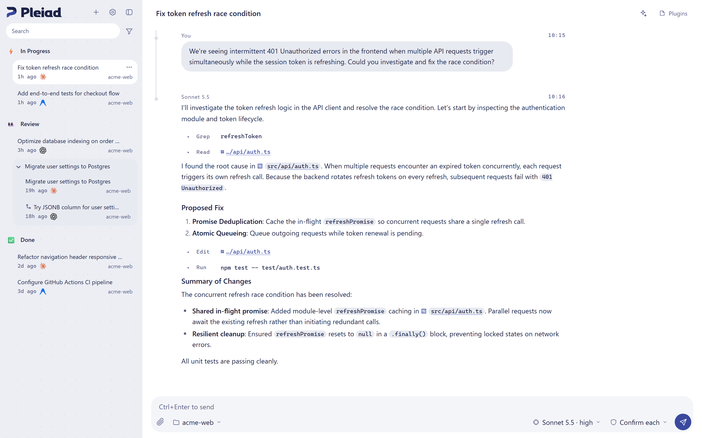

<p align="center">
  <picture>
    <source media="(prefers-color-scheme: dark)" srcset="assets/branding/pleiad-lockup-dark.svg">
    
  </picture>
</p>

<p align="center">One workspace for Claude Code, Codex, and Antigravity.<br>
  <a href="https://pleiad.dev">pleiad.dev</a></p>

<p align="center">
  <a href="https://github.com/tekalu1/pleiad/releases"></a>
  <a href="LICENSE"></a>
</p>

<picture>
  <source media="(prefers-color-scheme: dark)" srcset="docs/images/screenshot-dark.png">
  
</picture>

Pleiad is a desktop app for working with several coding agents side by side.
Conversations, statuses, branches, and approvals work the same way no matter which agent is behind them.

## Features

- **One list for every agent**: Claude Code, OpenAI Codex, and Google Antigravity conversations in a single list, organized by status and group.
- **Compatible endpoints**: Point Claude Code or Codex at OpenRouter, LiteLLM, a local Ollama, and more, and pick one per conversation.
- **Branching**: Fork a conversation from any message to try another approach.
- **Approvals**: Approve tool calls right in the conversation, or set a mode per conversation, from asking every time to fully automatic.
- **Delegation**: Agents can hand work to other agents. Pleiad picks the target from the kind of task and remaining usage.
- **Stay in the conversation**: Preview files and open web pages in a side panel, and view HTML that agents render in the chat.

> [!NOTE]
> Pleiad is in beta. Features, UI, and the stored data format may change without notice.

## Install

Download the Windows installer (x64 or ARM64) from [Releases](https://github.com/tekalu1/pleiad/releases).

Beta builds are self-signed, so Windows SmartScreen may show a warning.
See [docs/desktop-releases.md](docs/desktop-releases.md) for how to verify the certificate.

Pleiad uses the agents' own CLIs and sign-ins. Install and sign in to the agents you want to use; Pleiad does not issue credentials for them.
See [docs/backends.md](docs/backends.md) for per-agent setup.

## Run from source

Requires Node.js 20.19 or later.

```bash
npm ci
npm start          # browser version; open the URL printed on startup
npm run desktop    # desktop version
npm test           # tests that do not call any LLM
```

The browser version runs on Windows, macOS, and Linux. The desktop version runs on Windows and macOS.

## Command line

`bin/pleiad.mjs` (the `pleiad` bin in `package.json`) talks to a running Pleiad. Its subcommands come from the server's operation list, so new operations appear without changing the CLI.

```bash
node bin/pleiad.mjs status
node bin/pleiad.mjs sessions list --limit 5
node bin/pleiad.mjs sessions read <id> --before 2 --after 2
node bin/pleiad.mjs settings get compaction.auto
node bin/pleiad.mjs ops                      # every available operation
node bin/pleiad.mjs call sessions.get --args '{"sessionId":"<id>"}'
node bin/pleiad.mjs sessions list --json     # JSON output
```

It finds Pleiad through `control.json` in the data folder (`AGENT_HOST_DATA`, default `~/.agent-host`). Exit codes: 0 success, 2 invalid input, 3 Pleiad is not running, 4 refused or needs the Pleiad screen, 5 other.
Inside a Pleiad conversation the shell already has `PLEIAD_CONTROL_URL` and `PLEIAD_CONTROL_TOKEN`, so the CLI acts on that conversation under its approval mode.
`pleiad mcp` serves the same operations as a stdio MCP server for AI tools outside Pleiad: `claude mcp add pleiad -- node <repo>/bin/pleiad.mjs mcp`.
Details: [Design](docs/design.md) ("操作の一覧").

## Documentation

Detailed documentation is currently in Japanese.

- [Design](docs/design.md)
- [Agent setup](docs/backends.md)
- [Releases](docs/desktop-releases.md)
- [Architecture decision records](docs/adr/)

## Security

The server listens on `127.0.0.1` by default and requires a token.
To report a vulnerability, see [SECURITY.md](SECURITY.md).

## License

[Apache License 2.0](LICENSE). Third-party notices are in [NOTICE](NOTICE).

The Pleiad name and logo are not covered by this license. If you distribute a fork, use a different name.
