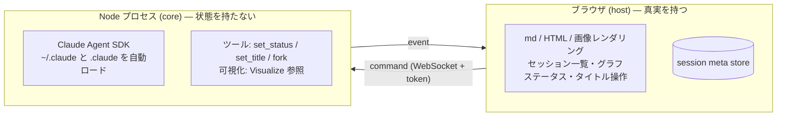

# 設計メモ

## 互換の接続先（2026-09-23）

procway-code への対応をやめる代わりに、Claude Code と Codex それぞれで互換 URL の接続先を登録し、会話ごとに選べるようにした。UX は承認済みのモック `docs/mockups/compat-endpoints.html` の案 A（入力欄のモデルの面に「接続先」の節。登録は設定 › エージェント設定の各エージェントの行の「接続先」）。画面の規則は design-system.md「入力欄の設定」「互換の接続先の管理」。

**形式はエージェントで固定。** Claude Code は Anthropic Messages 互換（CLI が `{URL}/v1/messages` に送る。URL に `/v1` は付けない）、Codex は OpenAI Responses 互換（`{URL}/responses`。codex-cli 0.153 は `wire_api = "chat"` を起動時エラーにするので、Chat Completions だけの先は使えない）。プリセットは Claude: OpenRouter / Z.ai / Kimi / DeepSeek / LiteLLM / Ollama / カスタム、Codex: OpenRouter / Azure OpenAI / Ollama / LM Studio / vLLM / LiteLLM / カスタム（`web/compat-presets.mjs`。Responses に対応していない先は Codex 側に出さない）。

**データ。** 一覧は `<data>/compat-endpoints.json`（`{ version: 1, endpoints: [{ id: 'ep-…', agent, name, preset, baseUrl, authMode, auth, roles, options: { contextTokens?, sendThinking? }, models, modelInfo?, verifiedAt, lastCheck: { ok, at, error?, latencyMs?, modelCount? } }], defaults: { claude, codex } }`）。キーは `<data>/compat-endpoint-secrets.json`（`core/secret-store.mjs`。Claude のアカウント・MCP と同じ safeStorage、使えない起動は 0600 の平文）。キーは画面へ返さない（`hasKey` だけ）、ログ・stderr の記録・イベント・エラー文・sidecar に出さない（`redactSecret`）。Claude の役割は main（会話の既定＝`ANTHROPIC_MODEL`）・opus・sonnet・haiku（背景の処理とタイトル生成）で、空の役割があると保存できない（Claude の名前がそのまま送られて失敗するため）。Codex は main（既定のモデル）だけ。実装は `core/compat-endpoints.mjs`。

**接続の確認。** 保存できるのは確認が通った接続情報だけ（確認 → 受領証 receipt → 保存。receipt は agent・URL・認証の送り方・キーのハッシュ・編集中の id に束縛し 15 分・1 回限り。名前・モデル・詳しい設定は変えても確かめ直さない）。確認は本物の 1 リクエスト: Claude は `POST {URL}/v1/messages`（max_tokens 1）を、認証が自動なら Bearer → x-api-key の順に試して通ったほうに決める。Codex は `POST {URL}/responses`（max_output_tokens 16、stream false、store false）で、404/405 なら本文の無い `POST {URL}/chat/completions` で道の有無だけ確かめ（生成しない）、あれば「Chat Completions にしか対応していない」と理由を付けて断る。401/403 はキー違い、404 は URL 違い、5xx は接続先のエラー、モデルが無いという 4xx は「URL とキーは通っている」として成功にする。あわせて `GET /v1/models?limit=1000`（Codex は `/models`）でモデルの一覧を取る（OpenAI 形式・Anthropic 形式のどちらも `data[].id`。取れなくても失敗にしない）。安全策: http(s) だけ、URL に userinfo・クエリ・フラグメントを入れない、公開のアドレスへの http は断る（ループバック・プライベートは可。名前は解決して確かめる）、リダイレクトは追わない（キーを別の宛先へ送らない）、20 秒で打ち切り、応答は 8MB まで。一覧の「接続を確認」は保存済みの値で確かめ直し、結果を `lastCheck` に記録する。

**モデルの表示と検索**（2026-09-23。`web/compat-models.mjs`・`web/search-terms.mjs`）。送る ID は一覧どおりのまま変えず、表示だけを変える。先頭の `anthropic/` は、その残りにさらに `/` があるときだけ隠す（OpenRouter が Claude Code 向けの一覧で他社のモデルに付ける名前空間で、サーバー側で外される。`anthropic/deepseek/deepseek-v4.1-flash` → `deepseek/deepseek-v4.1-flash`。OpenRouter の Claude `anthropic/claude-opus-5.5` は二重ではないのでそのまま）。末尾の `[1m]` は Claude Code の 1M コンテキストの印（CLI が送る前に外す）なので字から外し、小さな「1M」の札で示す（札を置けない字だけの場所では「（1M）」）。この形（`compatModelLabel`）を入力欄のモデルの面・チップ・設定の役割の欄・一覧の「モデル:」・「次のターンから適用」・右クリックメニューのモデルの補足で使い、title には送る ID を出す。一覧取得のときに `display_name`（Anthropic 形式）/ `name`（OpenAI 形式）とコンテキスト長（`max_input_tokens` / `context_length`）があれば `modelInfo: { [id]: { name?, context? } }` に保存し（取れた分だけ。`models` は ID の文字列の配列のまま＝旧形式もそのまま読める。確認し直すと取り直す）、候補の 2 行目と検索に使う。検索は大文字小文字を区別しない部分一致、空白区切りの語は AND（表示名・送る ID・display_name のどれに当たってもよい）。数百件でも重くならないよう描くのは先頭 50 件で、残りは「ほかに N 件。文字を入れて絞り込んでください」。一覧に無い字は Enter でそのまま使える（表示名に当たればその ID。表示名が同じ `x` と `x[1m]` は札の無いほうを先に。触っていない欄は値を変えない）。

**会話ごとの選択。** Claude のアカウントと同じ経路: `setTurnSettings { endpoint }` → `nextSettings.endpoint` → 次の `runTurn` で `compatEndpoints.resolve()`（削除済み・エージェント違い・前回の確認に失敗・キーが読めない → `EndpointError` で送信を止めて理由を返す。黙って公式に戻さない）→ sidecar の `compatEndpoint`（'' = 公式）→ バックエンドへ `endpoint`（キーを含む。受け取れるバックエンドは `capabilities.compatEndpoints`）。接続先を変えるとモデルは ''（接続先のメイン）に戻す。エージェントを変えると、変えた先の既定（下記）。互換の会話のモデルは接続先の一覧＋自由入力なので、`validModel` は形だけを見る（`/` `:` を含む ID・一覧外も可。黙って既定に戻さない）。公式の既定のモデル・段（prefs）は互換の会話へ持ち込まず、互換の会話で選んだモデル・段も prefs に覚えない。段（effortOptions）は互換の接続先では既定の段を作らない（Codex は low / medium / high、Claude は「思考を送る」がオンのときだけ Claude の段）。互換の会話ではアカウント（OAuth）を使わない。
引き継ぎ: 分岐（`inheritSettings`）と同じエージェントの新しい会話への引き継ぎは接続先も継ぐ（削除済みは継がない）。`ply_delegate` の子は同じエージェントなら親の接続先を継ぎ、違うエージェントなら公式（`delegatedEndpoint`。形式が合わないため）。**新しい会話の既定**は設定の一覧で「既定にする」を押した接続先だけ（`defaults`。入力欄で選んでも既定にならない。サブスクを使っているつもりでキー課金になる事故を避ける）。タイトル生成もその会話の接続先で（Claude は Haiku 相当、Codex は既定のモデル）。使用量（枠）は互換の接続先では出せないので、使用量の画面に接続先ごとの一文を出す。

**Claude への注入**（`core/backends/claude.mjs`、`claudeCompatEnv` / `writeClaudeFlagSettings`）。`options.env` は親の `ANTHROPIC_*`・`CLAUDE_CODE_USE_*`・`CLAUDE_CODE_OAUTH_TOKEN` などを外してから、`ANTHROPIC_BASE_URL`、キー（Bearer は `ANTHROPIC_AUTH_TOKEN`＋`ANTHROPIC_API_KEY=""`、x-api-key は逆。キーの無い先にもダミーの Bearer を入れる。入れないとログイン中の OAuth が送られうる）、役割のモデル（`ANTHROPIC_MODEL`・`ANTHROPIC_DEFAULT_{OPUS,SONNET,HAIKU,FABLE}_MODEL`）、安定化（`CLAUDE_CODE_DISABLE_EXPERIMENTAL_BETAS=1`・`CLAUDE_CODE_DISABLE_NONESSENTIAL_TRAFFIC=1`・`CLAUDE_CODE_ATTRIBUTION_HEADER=0`）、コンテキスト長（`CLAUDE_CODE_MAX_CONTEXT_TOKENS`）を入れる。**同じ値を「フラグ設定」（`--settings`）のファイルにも書く**: 利用者の `~/.claude/settings.json` の `env` は `options.env` に勝つが、フラグ設定の `env` には負ける（スパイクで確認）。`options.settings` をオブジェクトで渡すと argv に JSON のまま載ってキーがプロセス一覧に出るので、データ置き場の `run/claude-compat-<uuid>.json`（0600）に書いてパスを渡し、ターンの終わりに消す（消し損ねは起動時に片付ける）。Pleiad が指示を担当するときのフラグ設定（`claudeMdExcludes` など）も同じファイルに入れる。`settingSources` は変えない（skills・hooks・memory はそのまま）。モデルは明示して渡す（'' ならメイン）。
思考とエフォート（決定 4）: 既定では送らない。CLI はオプションを渡さなくても `thinking: {type:"adaptive"}` と `output_config.effort` を送るので、`CLAUDE_CODE_DISABLE_THINKING=1` と `CLAUDE_CODE_EFFORT_LEVEL=unset` で止める（スパイクで本文から消えることを確認）。接続先の「詳しい設定」の「思考を送る」をオンにした先（思考が必須の Kimi、この接続先経由の Claude など）には従来どおり送り、段も選べる。

**Codex への注入**（`core/backends/codex.mjs`、`codexCompatThread`）。app-server は全会話で 1 本の共有のまま、スレッドごとに `thread/start`・`thread/resume` に `modelProvider: 'ply_<接続先 id>_<接続情報のハッシュ>'` と `config['model_providers.<id>'] = { name, base_url, wire_api: 'responses', requires_openai_auth: false, supports_websockets: false, experimental_bearer_token | http_headers: { 'api-key' } }` を渡す（鍵は JSON-RPC の stdin に載り、argv・環境に出ない。`env_key` は app-server の環境を読むので会話ごとに変えられない）。互換の会話では `web_search = "disabled"`（互換の先は Responses のネイティブ web_search を持たないことが多い）と、あれば `model_context_window`。公式の `model/list` は互換の先のモデルを返さないので使わず、`''` の段の既定を公式の config から持ち込まない。
ロード済みのスレッドへの `thread/resume` は `modelProvider`・`config` を無視する（スパイクで確認）ので、スレッドがどの provider で読み込まれているかを覚え、接続先が変わった（互換 ↔ 公式、別の互換、URL・キーの変更＝provider の id が変わる）スレッドは `thread/unsubscribe` してから resume する。互換から公式へ戻すときは `config/read` の `model_provider`（無ければ `openai`）を明示する。これで会話の途中でも次のターンから接続先を変えられる。

**スパイクの結論（2026-09-23、codex-cli 0.153.2 / Agent SDK 0.3.258。実 LLM は呼ばずダミーのサーバーで）**
- Codex: 共有の app-server のまま、スレッドごとの `modelProvider`＋`config` で別の接続先に届き、並べた公式のスレッドは公式のまま。`experimental_bearer_token`・`env_key`・`http_headers` のどれでも鍵が届く。ロード済みのスレッドの resume は provider の変更を無視し、`thread/unsubscribe` 後の resume なら効く。新しい app-server で provider を渡さずに resume すると、スレッドに記録された provider ではなく設定の既定で動く。→ 接続先ごとに app-server を分ける必要はない。
- Claude: `options.env` の値で `POST /v1/messages?beta=true` がダミーに届き、`model: 'haiku'` は `ANTHROPIC_DEFAULT_HAIKU_MODEL` に置き換わる。利用者の settings.json の `env` が `options.env` に勝ち、フラグ設定の `env` はそれにも勝つ。`CLAUDE_CODE_OAUTH_TOKEN` が残っていても `ANTHROPIC_AUTH_TOKEN` が優先される（それでも外す）。

**モックからの差分**
- 使用量の画面は接続先ごとの見出しと「表示できません」の一文だけで、接続先ごとの tokens の表は出さない（使用実績はエージェントごとの合計に含まれる）。
- Claude の接続先の「詳しい設定」に「思考を送る」を足し、一覧の行に「思考とエフォート: 送る／送らない」を出す（決定 4）。エフォートの無効の理由も「思考を送る」がオフのためと書く。
- Codex の追加の流れにも「認証の送り方」（Bearer / api-key ヘッダー）を出す（Azure をカスタムで入れる人のため）。Codex の確認は出力の上限を 16 にした（OpenAI の Responses の最小値）ので「出力 1 トークン」ではなく「ごくわずか」と書く。
- 前回の確認に失敗している接続先を選んでいる会話も、削除と同じく送信を止める（決定の「確認失敗の接続先を指す会話は黙って公式に戻さない」）。入力欄の上の一文と、接続先の行の ⚠ で知らせる。
- Claude のアカウントの節は、従来どおりアカウントを登録している（または選んでいる）会話だけに出す（モックは常に出していた）。
- 公開のアドレスへの http の URL は確認の段で断る（キーを平文で送らないため。モックに無い安全策）。

**既知の制約**
- 利用者の settings.json に `apiKeyHelper` があると、互換の会話でもそちらのキーが使われる可能性がある（フラグ設定で打ち消す口が無い。未確認）。
- 使用実績（Pleiad が数えた tokens）はエージェントごとの合計で、接続先ごとには分けていない。参考費用は互換の接続先では当てにならない。
- Web 検索・Fast mode・MCP の tool search など Anthropic 側の機能は互換の先では使えない・不明。Web 検索の失敗には一文を足すが、事前には隠さない。
- Codex の互換の先の多くはステートレス（`previous_response_id` 不可）。Codex は毎回全体を送るので通常の会話は動くが、サーバー側の状態を前提にした機能は保証しない。
- 会話の途中で Claude の接続先を変えると、前の接続先の thinking の署名が次の先で拒否されうる（Claude Code は署名の拒否を検知して thinking を落として再試行する）。
- 旧 procway の会話は一覧に残し、開くと「procway-code への対応は終了しました。この会話は続けられません。」と読むだけ（`core/backends/index.mjs` の `RETIRED`。送信・設定の変更は断る）。

## Claude のアカウント切り替え（2026-09-22）

仕事用と個人用のように複数の Claude サブスクを、モデルと同じく会話ごとに選べるようにする。アカウントごとに `claude setup-token` で発行した長期 OAuth トークンを登録し、その会話の `query()` の `env` にだけ `CLAUDE_CODE_OAUTH_TOKEN` を入れる。`process.env` は書き換えない（Pleiad から起動するすべての会話がそのアカウントになるため）。`CLAUDE_CONFIG_DIR` は切り替えないので、transcript・CLAUDE.md・skills・MCP は両アカウントで共有し、会話の途中でアカウントを変えても resume で続く。選択肢の既定は「ログイン中のアカウント」（トークンを入れない＝従来の動作）。`ANTHROPIC_API_KEY` がある環境では CLI の優先順位どおりそちらが勝つ。

一覧（id・表示名）は `<data>/claude-accounts.json`、トークンは `<data>/claude-account-secrets.json` に置き、MCP の秘密と同じ `core/secret-store.mjs`（safeStorage で暗号化、使えない起動は 0600 の平文）を使う。トークンはクライアントへ返さず（`hasToken` のみ）、ログ・stderr の記録・エラーメッセージからは伏せる。実装は `core/claude-accounts.mjs`。

会話の選択は sidecar の `claudeAccount`（空文字＝ログイン中）。`setTurnSettings { account }` で `nextSettings.account` に予約し、次の `runTurn` で確定する（モデルと同じ）。runTurn は開始前にトークンを解決し、バックエンドへ `oauthToken` で渡す。アカウントを受け取れるバックエンドは `capabilities.claudeAccounts` で宣言する。削除済み・トークン未登録・復号できないアカウントを指す会話は送信を止めて理由を返し、別のアカウントでは走らせない。分岐（`inheritSettings`）・引き継いで作る新しい会話・`ply_delegate` の子は元の会話のアカウントを継ぐ。引き継ぎ元の無い新しい会話は、最後に人が選んだアカウント（prefs の `claudeAccount`）で始める。そのアカウントが削除済みならログイン中のアカウントで始める。タイトル生成もその会話のアカウントで回す。使用量は、アカウントを登録していれば「ログイン中のアカウント」と各アカウントを見出し付きで並べる（`quota.accounts`）。

setup-token が発行するトークンの scope は `user:inference` だけで、使用量の照会に要る権限を持たない（2026-09-23 確認、画面は「使用枠を取得できません」）。そこで使用量は会話用のトークンでは読まず、アカウントごとの設定フォルダ `<data>/claude-usage/<id>` で `claude auth login` した資格情報で読む（`CLAUDE_CONFIG_DIR` をそのフォルダにし、`CLAUDE_CODE_OAUTH_TOKEN` は外す）。会話は setup-token と共有の設定フォルダのまま。認可が済むと Pleiad がフォルダに `ply-usage-login.json` を置き、一覧の `usageLogin` になる。未認可のアカウントは使用量を読みに行かず、「使用量の表示を認可」への案内とボタンを出す（`needsUsageLogin`）。アカウントを消すとフォルダごと消す。

このため、会話のトークンと使用量の資格情報は別々に認可され、同じアカウントである保証がない。`claude setup-token` はブラウザーでログイン中の claude.ai アカウントで黙って発行されるので、別アカウントのままブラウザーで認可すると、使用量の表示は正しいアカウントなのに会話の消費は別アカウントに付く（2026-09-23 に実際に起きた。本来のアカウントの枠は 0% のまま、別のアカウントの枠だけが減った）。そこでトークンを保存したとき（貼り付け・Pleiad での発行のどちらも。差し替えたら記録を消して確かめ直す）、そのトークンで `GET /v1/models?limit=1`（`anthropic-beta: oauth-2025-04-20`。推論を消費しない。`/api/oauth/profile` は scope が足りず読めない）を送り、応答ヘッダー `anthropic-organization-id` を `claude-accounts.json` のそのアカウントに `tokenOrg`・`tokenCheckedAt` として記録する（10 秒で打ち切り、失敗しても保存は止めず未確認のまま。送り先は `AGENT_HOST_ANTHROPIC_API` で差し替えられ、テストは `off`）。この仕組みより前に保存したトークンは、一覧を引いたときに裏で 1 度確かめ、記録できたら `claudeAccountsChanged` を送る（同じアカウントの確認は 1 本にまとめ、失敗したら 5 分は確かめ直さない）。一覧（`claudeAccounts`）は `tokenOrg` を使用量フォルダの `.claude.json` の `oauthAccount.organizationUuid` と比べた `tokenCheck`（`ok` / `mismatch` / `unknown`）を返す。`mismatch` には本来の持ち主（使用量の認可のメールアドレス）と、分かれば実際の持ち主（ほかの登録アカウントの名前、または `~/.claude.json`（`CLAUDE_CONFIG_DIR` があればその中）のログイン中のアカウント）を添え、2 つの登録のトークンが同じ組織なら `sameTokenAs` を付ける。画面はその行と認可の完了のカードに ⚠ の一文と「トークンを発行し直す」を出す。組織の id・メールアドレスはログに出さない。

認可は Pleiad が行う（2026-09-23、`core/claude-login.mjs`）。`claude setup-token` は端末（TTY）がないと何も出力せずに止まるため、疑似端末（node-pty 1.1。N-API の prebuild を Electron でそのまま読む。`npmRebuild: false`）の下で CLI を起動する。CLI は認可 URL（戻り先 `platform.claude.com/oauth/code/callback`）と `Paste code here if prompted >` を出してコードを待つ。Pleiad は出力から ANSI・OSC 8 のハイパーリンクを除き、折り返しをつないで URL を読み、画面に「ブラウザーで認可する」→「ブラウザーに表示されたコードを貼ってください」の順で出す。コードは疑似端末へ書き、setup-token は表示されたトークン（`sk-ant-…`）をそのままアカウントの秘密へしまう（画面・イベント・ログには出さない。失敗の文面からもトークンと貼ったコードを伏せる）。`claude auth login` は終了コード 0 で完了とする。CLI 自身にはブラウザーを開かせず（`BROWSER` を存在しないパスにする。CLI は `BROWSER` を尊重し、開けなければ URL を出すだけ）、デスクトップ版はサーバーが main に頼んで既定のブラウザーで開き、ブラウザー版は押した時点で開けておいた窓を URL へ移す。setup-token は使い捨ての設定フォルダで回し、共有の設定フォルダに触れない。認可は一度に 1 つで、10 分で時間切れ。node-pty を読めない環境では setup-token はトークンの手動貼り付け（ターミナルで `claude setup-token`）へ案内し、`claude auth login` は TTY なしでも URL とコード待ちを出すのでパイプで回す。コードを貼った後の本物の出力（トークンの表示形式・auth login の完了表示）は未確認のため、読み取りは幅を持たせてある（行をまたぐトークン、枠線、再描画で最長を採る）。

## 完了通知・文中のスキル（2026-09-18）

正常完了の `turnEnd` に結果と完了時刻を含め、開いている会話に限らずデスクトップ通知を出す。中断・失敗・再キュー・履歴の再表示は対象外。同じ会話の同じ完了は重複通知しない。デスクトップ版は信頼済みのメインフレームから IPC を通して Electron の OS 通知を使い、クリックでウィンドウを復帰して対象会話を開く。通知内容は会話名のみとし、本文やツール出力は載せない。ブラウザー版は送信操作時に通知許可を一度要求し、許可済みの場合に通知する。OS 未対応や通知拒否は会話の進行を妨げない。

スキル候補はカーソル位置の `/名前` を補完し、文中・複数指定・既存文の途中への挿入を扱う。Pleiad がスキル読み込みを担当する場合、文中の `/名前` も明示指定として扱い、手動呼び出し専用のスキルを公開する。

## タイトル生成（2026-09-15）

明示操作のタイトル候補生成は、会話のモデル・エフォートを引き継がず、生成側の軽量モデルを使う。Claude は `haiku`、Codex は `gpt-5.6-luna` / `low`。Codex は `model/list` から選び、`gpt-5.6-luna` が無ければ名前に luna / mini / nano / spark を含むもの（この順）、それも無ければ model を渡さず codex の既定（config.toml / isDefault。会話のモデルではない）に任せる。`low` は選んだモデルが対応する（または段が分からない）ときだけ渡す。一覧に無いモデルを名指しして生成ごと落ちるのを避けるため。Codex は一時スレッドで実行する。モデル選定: https://learn.chatgpt.com/docs/models 。


## 使用量（2026-09-14）

設定の「使用量」で、アカウント全体のサブスク枠と Pleiad 内で完了した実行の実績を分けて表示する。`providerUsage { backend }` は使用率・残率・リセット日時・取得日時と、直近5時間／7日間の入力・出力トークンおよび参考費用を返す。取得は表示時と表示中の1分間隔。バックエンドごとに1分キャッシュし、同時取得を共有する。失敗時は空の枠と理由を返し、残量0とは扱わない。リセット時刻を過ぎた値も現在の残量として表示しない。エージェントは `ply_agents` の `ply_usage` で同じキャッシュの値を読める（[agent-delegation.md](agent-delegation.md)）。

Codex は公式 app-server の `account/rateLimits/read` の複数バケットを使う（https://learn.chatgpt.com/docs/app-server#6-rate-limits-chatgpt）。期間は返却された分数に従い、5時間／週次を推測しない。Claude はインストール済み SDK の `usage_EXPERIMENTAL_MAY_CHANGE_DO_NOT_RELY_ON_THIS_API_YET` を使う。プロンプトを送らない専用プロセスで制御コマンドのみを実行し、終了時に閉じる。実験的 API の未対応・権限不足は取得失敗として扱う。


使用実績は導入後にこの Pleiad で完了した実行のみを `usage.json` に記録する。過去履歴・他端末・Pleiad 外の実行・実行途中の値は含めない。取得できなかった数値は null、計測済み実行だけの合計は「一部」と表示する。サブスク残率へ換算せず、推計費用も請求額と区別する。入力トークンはキャッシュを含む。Claude は result の modelUsage（サブエージェントを含む）を使用し、Codex は thread 累計の差分から前の実行分と重複通知を除く。実行IDで重複保存を防ぎ、直列化した一時ファイルへの書き込みと rename で保存する。

Antigravity は `agy --print /usage --output-format json` の読み取り専用コマンドで、モデルグループごとの5時間／週次の残率・リセット日時を取得する。同じグループのモデルは枠を共有するので合算しない。`--version` で 1.1.11 以降を確認してから照会し、古い版で `/usage` がモデルへの依頼になるのを防ぐ。`status: SUCCESS`・`num_turns: 0`・`command.name: usage` の構造化応答だけを採用する。欠損や範囲外の残率は不明。取得には時間・出力サイズの上限を設け、資格情報・生のエラーは返さない。公式変更履歴: https://github.com/google-antigravity/antigravity-cli/blob/main/CHANGELOG.md （1.1.11）。

## エフォート（2026-09-14）

`effort` は会話の sidecar に保存し、`nextSettings.effort` で次の送信へ予約する。実行中の変更は現在のターンへ渡さない。取り消し・再起動・新規会話への引き継ぎ・分岐はモデルと同じ扱い。明示的な選択はエージェント別の新規既定にも保存する。空文字はネイティブの既定に従う。

Codex は `model/list` の `supportedReasoningEfforts` を候補として `turn/start.effort` へ渡す。`model/list` は `nextCursor` を追って全ページ読み、引けた結果だけを 5 分覚える（1 ページでも失敗したら全体を失敗とし、前に引けた一覧があればそれを返す）。ログイン完了とログアウトで捨てる。画面は語彙をエージェントごとに覚え、モデルの面を開くたびに裏で取り直して変わっていれば描き直す。ログイン・ログアウトの後は捨てて取り直す。既定へ戻す際は `config/read` とモデルの既定を解決して毎ターン指定し、ロード済み thread の以前の指定を上書きする。仕様: https://learn.chatgpt.com/docs/app-server 。Claude Code は Agent SDK の `options.effort`（low / medium / high / xhigh / max）を使う。モデルによる対応範囲の違いは SDK が扱う。


保存時と実行前に値を検証する。エージェント・モデル変更時に以前の値が非対応なら既定へ戻し、明示的な不正値は拒否する。

## デスクトップの更新（2026-09-12）

Pleiad の画面・サーバー・デスクトップを一つのバージョンとして配布する。
Electron main が electron-updater と更新設定を持ち、sandbox preload は限定した更新操作と状態通知だけを公開する。
更新は自動確認・自動ダウンロード（設定でオフにできる）・明示的な再起動に分ける。脇の通知は後回しにでき、詳細と再起動の確認は設定画面で行う。更新時のサーバーロックは処理中コマンド、ターン、承認、送信キューの処理を確認し、新規処理の開始と終了判定の競合を防ぐ。
安定版・先行版と段階配信の公開手順、署名資格情報、データ形式の互換性は `docs/desktop-releases.md`。
コードと配布先は public リポジトリ `tekalu1/pleiad` にまとめ、自己署名の評価版を Releases で配布する。Actions は自分のリポジトリ（`github.repository`）へ標準の GITHUB_TOKEN でアップロードする。アプリに焼き込む更新フィードはアップロード先と分け、既定は `tekalu1/pleiad`（`PLY_RELEASE_REPOSITORY` で上書き）。正式配布版の更新認証は Electron main で起動環境または GitHub CLI から毎回取得し、画面・設定保存・サーバーへ渡さない。未認証時は再ログインを案内する。非公開GitHubプロバイダー用のメタデータ名は先行版も `latest*.yml` とする。

## 作業中のメッセージ送信（2026-09-12）

画面の送信は `sendMessage` で受け付け、実行を開始する `runTurn` と分ける。セッションごとの `outbox` を sidecar に保存してから受領応答を返す。送信IDはブラウザーでも保持し、同じIDの再送を重複実行しない。本文・添付・送信時刻・配送状態を保持する。

途中送信は `control.steer(item)` で渡す。`item` は outbox の項目そのもの（`{ id, args }`）で、バックエンドは本文に `item.args.prompt` を、相手に預ける照合用の id に `item.id` を使う。返りは true = 受理 / false = 受理できない（送信待ちへ戻す）/ throw = 結果不明。

Codex は実行中のハンドルに `steer` を公開し、`turn/steer` に `expectedTurnId` と `clientUserMessageId`（= `item.id`）を付けて途中入力する。公式仕様: https://learn.chatgpt.com/docs/app-server#steer-an-active-turn 。Claude（2026-09〜）もターンの間 CLI の入力を開けたままにして `steer` を公開し、開いた入力へ user メッセージを `priority: "next"` で流す。走っているツールの結果の区切り（承認待ちなら承認が返った区切り）で今のターンに折り込まれ、**そのターンの中で**答える。main が止まっていればその場が区切りになり、すぐ答える。入力を閉じた後（ターンの終わり際）は受け付けず、次のターンへ回す（詳細は multi-backend.md §2.2）。Antigravity（agy は 1 行 1 ターンで、途中の入力は今のターンが終わってから別のターンとして走る。実測 2026-09）と次ターン設定が予約されている場合は、現在のターンが終わってから順番に実行する。古い Codex がプロトコル上明示的に拒否した場合も待機する。通信切断・タイムアウトなど、受領結果が不明な場合は自動再送しない。

受理と「エージェントに渡った」は別の瞬間として扱う。渡った合図を後から出せるバックエンドは `control.steerConfirms = true` を立て、会話に入った時点で `userMessage.delivered { messageId }` を出す。server はこれが立っているときだけ `userMessage` に `pending: true` を載せ、web は渡るまでの間だけ吹き出しの下に回る弧と「次の区切りで AI に渡します」を出す。渡れば消し、渡らないままターンが終わったら「この作業には間に合いませんでした。続けて答えます」に言い換える（その後で渡れば消える）。合図を出せないバックエンドでは `pending` を載せない＝今までどおり「AIへ送信済み」だけを出す。

受理した発言を読まないままターンが死んだとき（中断・失敗・ラウンド上限）は `userMessage.dropped { messageId }` を出す。server はその発言を送信待ちの「保留」へ戻し、web は吹き出しを会話から下げる。勝手には送り直さない（ターンが死んだ直後で、続けて送ってよいか分からない）。

待機メッセージは取り消し可能。停止・実行失敗では待機を保留し、勝手に再開しない。サーバー再起動時は待機を保留、配送中を結果不明として復元し、人間が会話を確認して再送または取り消せる。送信待ちにエラー・保留がある場合は後続も順序を維持して待つ。新規送信による別ターンの並列起動はしない。各セッションの未処理メッセージは100件まで。送信待ち（`queued`）の画面向けの項目には、何を待っているかを `waiting` として添える: `turn`（この会話のターン・準備・外部ターン）、`order`（先頭が保留・失敗・結果不明）。`waiting` は保存せず、kick のたびに決め直す。会話をまたいだ同時実行の本数には上限を置かない（以前の `AGENT_HOST_MAX_TURNS` は 2026-09-23 に廃止）。

配送済みの追加発言を `userMessage` で配信し、実行中のスナップショットにも含める（`userMessage.delivered` も同じスナップショットに入れる。開き直しても「渡っていない」まま固まらない）。初回発言は `initialMessageId` でスナップショットのユーザー発言と対応させ、再生時に二重表示しない。追加指示のネイティブ履歴はエージェント側に保存される（Claude は折り込まれた分が `queued_command` として残るので、読み出しのときに元の位置へ差し戻す。multi-backend.md §2.2）。添付は従来の `present` 経路を使う。

作成 2026-08-27。Step 2 成果物。確定した判断と、その理由を残す。
判断の元になった生の pain は `temporary/pain-log.md`（追跡外）。
見た目（配色・形・部品・動き）の正本は `docs/design-system.md`。

---

## 1. 何を作るか

Claude Code を **セッションを離れずに扱えるようにするブラウザ host**。
エージェントのコアは Claude Agent SDK。UI・セッション管理・成果物の提示を自前で持つ。

## 2. 思想

### 2.1 セッションを離れずに済むこと

> 見るために離れる（ファイルを開きに行く）／
> 思い出すために離れる（どれが進行中か探す）／
> 続けるために離れる（分岐の行方を追う）
> —— この3つを無くす。

機能の採否はこれで判定する。3つに寄与しないものは入れない。

### 2.2 AI は人間と同じパートナー

**AI にできることと人間にできることを非対称にしない。**
人間がその場で新しいステータスを作れるなら AI も作れる。
人間がタイトルを変えられるなら AI も変えられる。人間が会話を分岐できるなら AI も分岐できる。

これは「AI を信用するかどうか」の話ではなく、**機能を二重に設計しない**という話でもある。
片方にしかできないことを作ると、UI もスキーマも権限も二重になる。

制約をかけるのは **能力ではなく、やり方**。
例: タイトルの自動更新を入れないのは「AI にタイトルを触らせたくない」からではない。
**黙って変わると人間が追えなくなる**から。AI が明示的に変え、履歴に残るなら人間と同じ扱いでよい。

（ワークスペースへの破壊的操作の承認フローは Claude Code の権限層がそのまま担う。
これはセッションのメタ情報とは別の層の話で、この思想とは直交する。）

## 3. スコープ

**やる**

| | 内容 | 対応する pain |
|---|---|---|
| R1 | Claude Code の skill / command / hooks / subagent / plugin / memory が使える。md レンダリング | P9 |
| R2 | 成果物をチャットの流れの中にインライン提示（HTML・画像・ファイル） | **P3, P4** |
| R3 | セッションの状態管理。事前定義なし。人間と AI が同じように設定できる | **P1, P2, P7** |
| R4 | セッションタイトルをいつでも変更できる（人間・AI どちらも） | P8 |
| R5 | 会話をグラフとして扱う（fork の可視化） | P6 |

**やらない**

- 公式クライアントの完全代替。差分表示・エディタ統合は VS Code に戻る
- マルチプロバイダ。コアを Agent SDK と決めた時点で当面外す
  - **v3 で改訂した**（`docs/multi-backend.md`）。`AgentBackend` を切り、Claude / Codex / Antigravity を並べる（procway-code も並べていたが 2026-09 に対応を終えた）
- タイトルの**暗黙の**自動更新。ターンごとに勝手に書き換わる挙動は入れない（人間が追えなくなる）。
  明示的な変更は人間・AI とも可
- グループ機能。R3 と R5 で代替する。両方持つと「グループに入れる手間」= P2 の元凶が残る

## 4. アーキテクチャ



**境界の原則: ツールは core、真実は host、core はイベントで通知するだけ。**

AI がステータスを変える流れ: core のツールが呼ばれる → core は `status.change` イベントを出すだけ →
host が store を更新して描画。**core は現在のステータスを保持しない**。
人間が UI から変えたときも、host が store を更新して同じイベントを描画する。
**経路は違っても、通る先は同じ**（思想 2.2）。これでコアを差し替えても host 側の資産が生き残る。

**プロトコル**は procway-code の Host Contract に倣った（procway-code への対応は 2026-09 に終えたが、形はそのまま）。設計をゼロから起こさない。

- `ready` に `protocolVersion`（整数）。host は必ずこれで gate する
- server → client: `ready` / `event` / `response` / `error`
- client → server: `command`（`runTurn` / `approve` / `abort` / `resume` / `listSessions` …）
- token gate は constant-time 比較。既定は localhost bind

WebSocket を選ぶ理由: SDK のストリーム（思考・ツール呼び出し・部分テキスト）を流しつつ、
**承認応答と中断が逆向きに必要**だから。片方向で足りるなら SSE でよいが、足りない。

## 5. セッションのデータモデル

**SDK が持っているものは SDK に持たせる。** v0 の実装時に判明した事実:

| 欲しいもの | SDK ネイティブ | 備考 |
|---|---|---|
| タイトル | `renameSession()` / `SDKSessionInfo.customTitle` | セッションの JSONL に永続化される |
| 状態 | `tagSession(id, tag)` / `SDKSessionInfo.tag` | **自由文字列。事前定義の仕組みが無い** = §6 とそのまま一致 |
| 分岐 | `forkSession(id, { upToMessageId, title })` | parentUuid 連鎖を保って複製する |
| 一覧 | `listSessions({ dir, limit, offset })` | 全プロジェクト横断。cwd / gitBranch / createdAt 付き |

これらは `~/.claude` に書かれるので、**公式の CLI・VS Code 拡張とメタ情報が共有される**。
agent-host で付けた状態やタイトルが公式クライアントからも見え、逆も同じ。
自前ストアに複製すると、この利点を失って二重管理になる。

**したがって Bet 3 を改訂する。**
当初「真実は host」としたが、正しくは **正本は `~/.claude`、host は SDK に無い差分だけを sidecar で持つ**。
「core は状態を持たない」（＝ core プロセスがメモリに抱えない）という意図は変わらない。

sidecar が持つのは次の3つだけ。**いずれも後から追加すると既存セッションが欠損する。**

```jsonc
// ~/.agent-host/sessions.json  — { [sessionId]: … }
{
  "statusChangedAt": "…",   // ★ tag がいつ変わったか。lastModified はセッション全体の mtime で代用できない
  "history": [              // ★ いつ・誰が・何を・なぜ。人間も AI も同じ形で残る
    { "at": "…", "by": "ai|human", "field": "status|title|parent",
      "from": "…", "to": "…", "reason": "…" }
  ],
  "parent": { "sessionId": "…", "atMessage": "…" }  // ★ forkSession は transcript 内の親子は保つが listSessions に出ない
}
```

`history` を status と title で分けない理由: 人間と AI、status と title を**同じ形で1本に残す**ほうが、
「いつ・誰が・何を・なぜ変えたか」を1箇所で追える。構造を二重にしない（思想 2.2）。

`by` を記録するのは**制限のためではなく、可読性のため**。この値で権限を分岐させない。

## 6. ステータスの設計

**事前定義しない。`id` と `label` だけ。AI も人間と同じように、その場で新しい状態を作ってよい。**

```jsonc
"status": { "id": "waiting-review", "label": "レビュー待ち" }
```

- **設定ファイルを持たない。** 状態は使われた時点で存在する
- 例外は人が先に作った空のグループ。`~/.agent-host/statuses.json`（アイコンと作った時刻）にある限り、セッションが 0 件でも存在する。削除すれば消える
- `actionable` のような意味づけの属性を持たない。並行10本規模なら、ラベルを読めば人間には分かる
- 語彙の収束は**強制せず、UI で促す**。入力時に既出のステータスを補完候補として出し、
  AI にも同じ候補を渡す。git のブランチ名やタグと同じ扱い —— 制約ではなく慣習で揃える

絞り込みが必要になったら **view 層の機能**として足せる（任意のステータスでフィルタ／並べ替え／ピン留め）。
スキーマ変更を伴わないので、今決める必要はない。

> **未解決の穴。** 「相手待ち」の類から戻ってくる契機は外部イベント（レビューが来た、CI が通った）で、
> AI もユーザーも気づけない。v1 は **`statusChangedAt` から N 日動いていないものを浮上させる**だけ。
> ラベルの意味を知らなくても成立するが、完全な解ではない。v2 で外部トリガーを検討する。

## 7. 成果物の提示（R2）

図・グラフ・UI プレビューは共通の Visualize 参照で表示する。Claude・Codex に同じスキル本文を注入し、回答に置いた参照を core が検証・読み込み・保存して会話内へ配信する。公開 MCP `present` は廃止。詳細は [可視化仕様](visualize.md)。

内容は `~/.agent-host/presents/<sessionId>.jsonl` に保存し、元ファイルの変更や削除から独立した履歴にする。新しい可視化は1 MiB以内のHTMLで、JavaScriptをopaque sandbox内で実行する。親画面の権限は渡さない。旧HTML履歴は静的sandboxのまま維持する。

画像は通常のMarkdown画像、ファイルはリンク、テキストは通常の回答を使う。ユーザー添付と旧提示カードのイベント・保存形式は保持する。

ファイルリンクは会話の右パネルで開く。Markdown・HTML・画像・CSV/TSV・原文・PDFを内容に合った形で表示する。相対パスは発言時点の作業場所から解決し、原文・保存・会話への添付を同じパネルで提供する。認証と実パスによるアクセス範囲を維持し、HTMLは可視化と同じ隔離（`allow-scripts` のみの sandbox と同じ CSP）でスクリプトを実行する。Visualizeの履歴保存とは異なり、現在のファイルを明示的に読み込む。詳細と制限は [ファイルプレビュー](file-preview-proposal.md)。

## 8. グラフ（R5）のスコープ

v1 では**グラフビューを作らない**。ただし `parent` は記録し、
一覧に「この会話は X の N 番目のメッセージから分岐」の1行を出す。

fork が使われなかった理由は「分岐したことが見えない」ことなので、
**1行の表示だけでも P6 への最小の答えになる**。グラフビューは v2。

fork は人間からも AI からも起こせる（思想 2.2）。
AI が「これは別の筋なので分ける」と判断して分岐できることが、P6 で本来やりたかったことに近い。

## 8.5 承認（v1 で追加）

v0 は許可リスト外を一律 deny していた。これでは `Write` も `Edit` も `Bash` も通らず、実作業に使えない。
v1 は `canUseTool` から host に問い、**会話の流れの中にカードとして出す**。

- ブラウザのモーダル（`confirm` 等）は使わない。以降のイベントを止めるうえ、
  会話から目を離させる —— 価値命題（離れずに済む）に真っ向から反する
- 読み取り専用ツールと host ツールは自動許可のまま。問うのはそれ以外
- **接続が切れたら pending は全部 deny で解決する。**
  SDK の `CanUseTool` は fail-closed で、応答しないとツールが無期限にブロックされる
  （park deadline が無い）。放置は「静かに固まる」を意味する

### 承認モード（v1.1 で追加）

都度確認だけでは、承認の回数が多い作業で会話が止まりすぎる。モードを切り替えられるようにした。

| | 挙動 |
|---|---|
| `default` 都度確認 | 危険な操作のたびに聞く（既定） |
| `auto` | モデルの分類器が判断し、迷うものだけ聞く |
| `acceptEdits` 編集は自動 | ファイル編集は自動、他は聞く |
| `plan` 計画のみ | ツールを実行しない |
| `bypass` YOLO | 確認なし・制限なし。Claude Code の権限層を通さない |

- `bypass` は SDK の `bypassPermissions`。`allowDangerouslySkipPermissions: true` を同時に渡す必要があり、
  このモードでは `canUseTool` が呼ばれない＝**承認カードが出ない**。
  以前は出さない判断だったが、他のエンジンには YOLO 相当があり、Claude だけ無いと委譲のときに
  親と同じ強さを継げない。危険の度合いは承認モードの2軸（`docs/multi-backend.md` §2.5）で表せるので、
  隠すのではなく「選んだことが見える」形で扱う
- モードはセッションに覚えさせる。入力欄のチップは今のモードの名前を出す（既定かどうかで色は変えない。確認なし・制限なしのモードだけ ⚠ と強い字。docs/design-system.md「入力欄の設定」）
  （緩めたまま忘れないため）
- **変えられるのは人間だけ。AI 用のツールは生やさない。**
  思想 2.2 は「AI にできることと人間にできることを非対称にしない」だが、
  §2.2 の括弧書きのとおり**権限層はこの思想と直交する**。
  AI が自分の承認モードを緩められるなら、承認フローそのものが意味を失う
- 変更は `history` に `field: "mode"` として残る（status / title と同じ扱い）

### host が離れたとき（v1.2 で修正）

**実運用で最悪の壊れ方をした。** 記録として理由ごと残す。

WS が切れているあいだ、承認が要るツールを**その場で deny し、ターンは走らせ続けて**いた。
結果として、読み取り系（`AUTO_ALLOW` の Read / Glob / Grep）だけが通り、書き込みは全部失敗する。
エージェントは動いているのに成果物がゼロで、**失敗したことにも気づけない**。
6体のサブエージェントが1件も出力を残せなかったのはこれが原因だった。

直した形:

- host が居ないあいだの承認は **deny せず保留する**。戻ってきたら聞き直す
- 猶予（既定 60 秒、`AGENT_HOST_GRACE_MS`）を過ぎたら、deny を返し続けるのではなく
  **ターンごと中断する**。黙って空回りさせない
- 猶予の判定はタイマーだけに頼らず、**経過時間で都度判定する**（タイマーの取りこぼしに耐える）
- **接続が来ても古い接続を閉じない。** 一度これをやって、
  自動再接続するクライアントと互いに閉じ合うライブロックを作った。
  タブが複数あってよい設計にして、イベントは全部に配る

教訓: **「承認できないから拒否」を既定にしてはいけない。**
拒否は前に進んでいるように見えて何も進んでいない。待つか、止めるかのどちらかにする。

## 9. Walking skeleton（Step 3）

1本で R1・R2・R3 と境界を同時に検証する。これが通れば残りは量の問題になる。

1. Node で SDK セッションを1本張る（`ANTHROPIC_API_KEY` 無しでサブスク認証が通ることを確認）
2. `~/.claude/skills` の skill が1つ発火する
3. Markdown の画像リンクで画像を1枚インライン表示する
4. `set_status` ツールで **その場で作った新しいステータス**を設定し、host の一覧に反映される
   （事前定義なしの経路を通すことが検証の主目的）
5. ブラウザから token 付き WebSocket で接続し、上記が全部流れる

## 10. 段階

| | 内容 |
|---|---|
| v0 | walking skeleton |
| v1 | R1・R2・R3・R4 + md レンダリング。`parent` は記録のみ |
| v2 | R5 グラフビュー、リモートアクセス、ステータス復帰の外部トリガー |

## 11. 決めたこと・残っていること

### サブエージェントの状態の印（2026-09-22）

作業ダイアログのサブエージェント行の左端に、状態の印を置く。実行中は既存の弧、完了は静止したチェック、失敗は静止した ✕、停止は静止した短い横線。
状態が分からない（状態を返せないバックエンド・まだ分からない子）ときは印を出さない。同じダイアログの Pleiad タスク行にも同じ印を付け、文字の状態表示は残す。
状態の材料はバックエンドの任意メソッド `getSubagentState`（multi-backend.md §2.3）。Claude はターン中に流れている SDK の task 系メッセージと委譲ツールの結果だけで判定し、親 transcript は読まない。

新しい印にした理由: 左の一覧の青い丸は「完了・未確認」（2026-09-12）であって完了ではない。会話を開いて確認すると消えるので、流用すると「一度見たら完了の印が消える」ことになり意味が壊れる。
文字（「完了 · 3 メッセージ」）だけで出す案もあった（同じダイアログの Pleiad タスク行と語彙が揃い、設計文書も変えずに済む）が、ユーザーは一目で分かる印を選んだ。
弧・衛星は「走っているときだけ DOM に置く」（design-system.md §6）ので、終わった行には置けない。そこで動かない印を新しく足した。色は使わず（§2.2）、塗りの円を含まない線画にして青い丸と形で見分ける。

「サブエージェント N」の N は走っている子だけを数える。サーバーの `running.count` も同じで、終わった子を数えると更新のゲートが閉じたままになる。
状態が `null` の子は走っている側に数える（状態を出さないバックエンドでゲートを緩めない）。終わった子はターンが終わるまで一覧に残る。ターンをまたいで残す履歴化と、`ply_delegate` の子の一覧統合はこのときはしていない。

### 完了・未確認（2026-09-12）

Pleiadでターンが終了すると（成功・失敗・中断を含む）、全エージェント共通でsidecarに `completedAt` を保存し、一覧・`turnEnd`・履歴読み込みに載せる。成功を意味する印ではなく、未確認の終了結果を示す。既存履歴の更新時刻から未確認を推測しない。

確認済みの完了時刻はブラウザーのlocalStorageに保存し、同じオリジンのタブ間で同期する。別端末の既読状態は独立。表示中かつ可視の会話の完了は確認済みとし、非表示タブでは戻ってきたときに確認済みにする。履歴は読み取り開始時点の完了時刻だけを確認する。再接続時は選択中の履歴を再読み込みする。進行中の弧を優先し、畳んだグループには中の未確認を示す丸を出す。

導入前・Pleiad外での実行・サーバー強制終了には完了記録がないため印は出ない。

**決めた**

- host は素の ESM。ビルド無し。外部依存は SDK と `ws` と `zod`、コンテキスト設定解析用の `smol-toml` / `yaml`
- md レンダリングとシンタックスハイライトは**自前**。外部ライブラリを入れない
  （インライン提示のために CSP を締めている以上、CDN も足せない。整合させる）
- sidecar の置き場は `~/.agent-host`。`~/.claude` は汚さない
- 新規セッションの作業ディレクトリは host で指定する。再開時はセッション自身の cwd を使うが、host が明示して送ってきたら
  それに変える（`history` に `field: "cwd"` で残し、`cwd` イベントで知らせる。バックエンドが新しい cwd でセッションを引き継げるかはバックエンド次第）

**残っている**

- リモート公開時の認証（v2）。今はローカル bind + token のみ
- 「相手待ち」からの復帰トリガー（§6 の穴）
- グラフビュー（§8）
- 承認の「常に許可」。SDK は `updatedPermissions` で受け取れるが、v1 では都度確認のみ


### 2026-09-11: 未送信セッションと次ターン設定

新規セッションは `newSession` でホストIDを発行し、`conversations.json` の空レコードとsidecarを保存してから応答する。初回のネイティブ実行IDは実行区間として紐づけ、UIのIDを変えない。タイトル・状態は送信前から変更できる。下書きは `saveDraft`、次ターンのエージェント・モデル・作業ディレクトリ予約は `setTurnSettings` で保存する。未指定の設定は既存の予約を保持し、`cancel` は全予約を取り消す。作業場所は保存時に絶対パスへ解決し、保存時と実行直前に存在を検証する。予約は実行中のハンドルを変更せず、次の `runTurn` の準備で検証・適用する。予約した作業場所は送信側の古い `cwd` より優先する。API互換のため既存の `setModel` / `switchBackend` は残すが、UIの変更は予約経路に統一する。

入力の保存に失敗した場合は入力を保持して案内する。未送信セッションの削除は明示操作のみ。任意位置の分岐拡張は別issue #3。

### セッション作成時の設定継承（2026-09-12）

新セッションは、直前に開いていた会話のエージェント・モデル・承認モードを引き継ぐ。
次ターンのエージェント・モデル変更が予約されていれば、その選択を使う。
別エージェントを明示した場合とエージェント変更予約がある場合の承認モードは、変更先の保存済み既定値を使う。変更先の承認モードを予約済みなら、その値を継承する。エージェント変更後の承認モード候補は変更先に合わせ、選択値は `nextSettings.mode` に保存する。実行中のモードは変更せず、次の送信準備で検証・適用する。
開いている会話がない場合は従来どおり保存済み既定値を使う。
分岐先は分岐元の現在の設定と次ターンの変更予約を独立したコピーとして保持する。
「既定に従う」モデルの空文字も明示的な選択として保存し、後の既定値変更で置き換えない。

## エージェント間の委譲（2026-09-15）

Claude・Codex 共通の `ply_agents` MCP で、Pleiad 管理の子会話を作成・継続・停止する。
ネイティブの `spawn_agent` / `agent_job` と名前・ID・完了通知の管理元を分ける。詳細は [agent-delegation.md](agent-delegation.md)。
