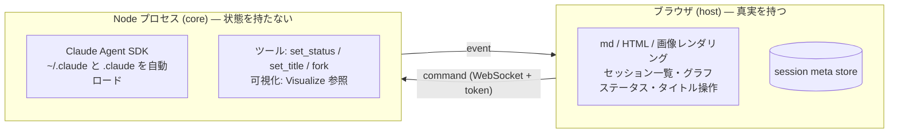

# 設計メモ

## 操作の一覧（2026-10-03）

画面・MCP・CLI が外へ出す操作の正本を `core/ops/` の操作の一覧（レジストリ）に置く（[ADR 0081](adr/0081-control-surface-registry.md)）。移行の段階は、0 枠と `app.status`、1（今）読むことと会話の題・状態・`ply_control`・`/api/ops`・CLI・`pleiad mcp`、2 設定を書くことと承認カード、3 `host`・`ply_browser`・`ply_agents` の移行。

- **定義**: `defineOp`（操作）と `defineSetting`（設定）。操作は `<領域>.<動詞>` の id・説明の辞書キー（`agent:ops.<id>.summary`。引数の説明は zod の `.describe('agent:ops.…')`）・入力の zod（`strict`。JSON Schema は `z.toJSONSchema`）・出力の形（read は必須）・危険度・出す口（`ui` / `mcp: direct｜catalog｜false` / `cli`）・handler を持つ。write は `riskReason`（なぜ guarded でないか）を書く。値に依って危険度が上がる操作は `riskOf`（定義の危険度を下げられない）と `confirm` を持つ。
- **関所**: すべての口は `registry.invoke(主体, id, args, deps)` を通る。順序は、操作が無い・その口に出していない・human-only を agent が呼んだ → `NOT_FOUND`（在ることを明かさない）→ `hostScreenOnly` で PC の画面の人間でない → `HOST_SCREEN_ONLY` → 入力の検査 → `INVALID`（`issues: [{ path, code, message }]`）→ `riskOf` → 権限（`core/ops/policy.mjs`）→ 記録（`deps.audit`。read 以外。引数は入れない）→ handler → 返り値の伏せ字（秘密らしい名前の欄の文字列を `••••` に）。失敗は `code` で見分け、文は `deps.locale` の言語。
- **権限**（[ADR 0082](adr/0082-control-surface-principals-and-risk.md)）: 主体は `human`（画面）と `agent`（Pleiad の中の AI の MCP・CLI・`pleiad mcp`。`via` と、束縛された会話の `sessionId`）。human は全部通す。agent は、read を通し、human-only を出さず、write は会話の範囲が none / readonly なら断り（`READ_ONLY_MODE`）、guarded は会話の承認モードで決める: 範囲 full かつ自律 never（bypass・yolo）なら通して記録を残し、それ以外は承認カード（段階 2。今は判定 `ask` を `NEEDS_APPROVAL` で返す）、会話に束縛されていなければ `NEEDS_UI`、none / readonly の会話は `READ_ONLY_MODE`。承認モードが引けない会話は弱い側（workspace・ask）に倒す。
- **WS**: 汎用コマンド `invoke { op, args }`（`PROTOCOL_VERSION` は据え置き）。新しい機能は protocol.mjs に足さずレジストリに書く。昔のコマンドは `legacyCommand` で対応を付けて段階的に置き換える。
- **操作（段階 1）**: `app.status`・`app.running`、`sessions.list`（絞り込みとページ送り。`cursor` は更新時刻と id）・`sessions.get`（メタ・子・最近の変更 10 件）・`sessions.read`（`messageId` の前後 `before`・`after` 件。上限は各 20 件・1 件 8000 字・合計 40000 字。`messageId` を省くと末尾。検索の hit の `uuid` をそのまま渡せる）・`sessions.setTitle`・`sessions.setStatus`（write。`sessionId` を省くと AI は自分の会話。人間は省けない。グループの根を動かすと中の会話も移る。`sessions.search` は [セッション検索](#セッション検索2026-10-03) の定義）、`settings.list / get / schema`（読むだけ）、`delegation.tasks / status`（読むだけ。依頼・結果の本文は一覧に載せず、結果は `offset` から 16000 字ずつ）。write は変更の記録（`sessions.json` の history）に `by: 'agent'`・`via`・`bySession`（どの会話の AI か）を残す。人間の操作（`setTitle`・`setStatus` コマンドと `invoke`）は同じ関数を通り `by: 'human'` のまま。
- **設定の一覧**（`core/ops/settings.mjs`）: prefs の既存キー（locale・linkOpen・instructionBudget・backend・model・effort・mode・claudeAccount・confirmAgentSites・confirmExternalLoads・agentSitePermissions・externalSitePermissions・browserProfiles・browserDefaultProfile・browserNewProfile・computerUse・delegationRouting・plyInstructions・addedContext）と `compaction.auto`・`context.default`。段階 1 は読むだけ（`readOnly`）。危険度は定義してあり、承認モードの既定 `mode` は human-only（agent の `settings.list` にも `get` にも出ない）、関所を緩める向きだけ上がるもの（`confirmAgentSites`・`confirmExternalLoads`・`computerUse`）は `riskOf`、許可の一覧・委譲の振り分け・Pleiad の指示・コンテキストは guarded。秘密（トークン・鍵）は設定に持たない。
- **ply_control**（会話ごとの HTTP の MCP `/mcp/control`。骨格は `core/mcp-bridge.mjs`）: Claude・Codex・Antigravity の全会話に既定で渡す（止める設定は無い）。会話ごとの Bearer が会話に束縛され、呼び出しは主体 `{ by: 'agent', via: 'mcp', sessionId }` で `registry.invoke` を通る。会話の id が決まるまでは束縛を決められないので呼びを失敗させる（束縛なしとして通さない）。直に出すツールは `search_sessions`・`get_session`・`read_session`・`get_setting` と `list_ops`（一覧。id を渡すと説明・入力の JSON Schema・危険度）・`call_op`（`{ op, args }`）。残りの操作は `list_ops` と `call_op` で呼ぶので、操作を足してもツールの量は変わらない（`mcp: 'direct'` を付けたものだけ増える。名前は `core/ops/registry.mjs` の `DIRECT_TOOL_NAMES`）。ツールの定義は `core/ops/surfaces/mcp.mjs` の生成器で作り、`pleiad mcp` も同じものを使う。`instructions`（3〜4 行）は MCP の `initialize` ではなく会話の指示欄に足す（二重にしない）。毎ターンの文の量（指示 + tools/list）は ja・en とも 1800 トークン以内（`ops-surface` の T4。今は約 900）。「指示の量」の内訳 `PLY_PARTS` に `control`。
  - **渡し方**: Claude は `mcpServers.ply_control`（http）・指示を `systemPrompt.append`・ツールごとの承認は聞かない（権限と承認は `registry.invoke` が会話の承認モードで決める）。Codex は `mcp_servers.ply_control`（`default_tools_approval_mode: approve`）・指示を `developerInstructions`。Antigravity は mcpServers の先頭の 1 本しか起こさないので、既存の中継（`core/agy-context-relay.mjs`）に `--control` を足して context・computer・browser と 1 本に束ねる。ツール名には `ply_control_` を付けて見せ、呼び出しで外す（一般的な名前が他と衝突しないように）。口は会話のあいだ同じで、変わったときだけ起こし直す。
  - **会話のシェルの環境変数**: `PLEIAD_CONTROL_URL`・`PLEIAD_CONTROL_TOKEN`（トークンは `ply_control` の Bearer と同じ）を渡し、会話のシェルから呼んだ `pleiad` をその会話に束縛する。Claude はクエリの env、Codex はスレッドごとの `shell_environment_policy.set`（内蔵ブラウザーの環境変数と束ねる。app-server は全会話で 1 本なのでプロセスの env では渡せない）、Antigravity は会話のプロセスの env。
- **HTTP と CLI**（[ADR 0083](adr/0083-control-surface-cli.md)）: サーバーは起動の案内を出す前に `<データ置き場>/control.json`（権限 0600。`version`・`pid`・`origin`・`cliToken`・`startedAt`・`appVersion`・`kind`（デスクトップ版は `desktop`、`npm start` は `server`））を書き、終了時に pid が自分のときだけ消す（強制終了で残っても、CLI は pid で見分ける）。`cliToken` は画面のトークンと別の乱数で、効くのは `GET /api/ops[?surface=cli|mcp]` と `POST /api/ops/<id>`（本文が引数。`{ ok, result }` か `{ ok: false, code, error, issues? }`。404 は `NOT_FOUND` 系・400 は `INVALID`・403 は `NEEDS_UI`・`NEEDS_APPROVAL`・`READ_ONLY_MODE`・`HOST_SCREEN_ONLY`）だけ。画面・WS・静的ファイル・`/mcp/control` には効かず、画面のトークンもここには効かない。主体は会話に束縛されない `agent`（`via: cli`。`pleiad mcp` は `x-pleiad-via: mcp-stdio`）で、guarded は `NEEDS_UI`。会話の接続のトークン（環境変数）は同じ会話に束縛された `via: cli` になり、その会話の承認モードに従う。言語は `x-pleiad-locale`（束縛された呼び出しは会話の言語）。
  - **CLI**（`bin/pleiad.mjs`。package.json の `bin`。Node の組み込みだけ）: `pleiad status`・`sessions list|get|read|rename|status`・`settings list|get|schema`・`delegation tasks|status`・`running`・`ops`（一覧）・`call <op> [--args '{…}']`・`mcp`。サブコマンドと引数は `GET /api/ops` を実行時に取って作る（id の `.` が区切り。位置引数は `cli.positional`、残りは `--<名前>`、型は JSON Schema から変換、`<コマンド> --help` で引数の説明）ので、サーバーに操作が増えれば CLI を作り直さずに出る。`--json` で結果（失敗も `code`・`error`・`issues`）を JSON に、`--lang ja|en`（既定は `AGENT_HOST_LOCALE`・PC の言語）。終了コードは 0 成功・2 入力の誤り（`INVALID`・`NOT_FOUND` 系）・3 Pleiad が起動していない（`control.json` が無い・pid が死んでいる・つながらない・401）・4 拒否または画面での操作が必要（`NEEDS_UI`・`NEEDS_APPROVAL`・`READ_ONLY_MODE`・`HOST_SCREEN_ONLY`）・5 その他。つなぎ先は環境変数 `PLEIAD_CONTROL_URL`・`PLEIAD_CONTROL_TOKEN`（会話に束縛）→ `AGENT_HOST_DATA`（無ければ `~/.agent-host`）の `control.json`（束縛なし）。ファイルを直に読む読み取りのモードは無い。デスクトップ版のインストーラーで `pleiad` を PATH に通すこと・CLI から Pleiad を起こす `--start` は後で決める。
  - **`pleiad mcp`**: 同じ一覧を stdio の MCP として出す（Pleiad の外の AI 向け。Pleiad の中の会話には束縛した `ply_control` を渡す）。Pleiad が起動していなければ `list_ops`・`call_op` の 2 本だけを出し、呼ぶと `code: NOT_RUNNING`。起動した・止まった・一覧が変わったときは `notifications/tools/list_changed`。登録の例: `claude mcp add pleiad -- node <リポジトリ>/bin/pleiad.mjs mcp`（別のデータ置き場は `AGENT_HOST_DATA` を環境に付ける）。
- **検査用の操作**: `AGENT_HOST_BACKENDS` に `fake` があるとき（テスト）だけ、権限の配線を確かめる `probe.guarded`（guarded）・`probe.humanOnly`（human-only。画面だけ）が載る（`core/ops/probe.mjs`）。fake バックエンドには、読み取り専用の `plan` と、確認なし・制限なしの `bypass` のモードがある。サーバー越しの検査は `ops-control`（`control.json`・HTTP の認証・会話への束縛・権限の配線・記録・伏せ字）、CLI と `pleiad mcp` は `ops-cli`、3 つのエージェントへの渡し方は `control-delivery`、会話・設定・委譲の中身は `ops-sessions`、生成器と橋は `ops-mcp`。

- **載せ忘れの検査**: `tests/lint-ops.mjs`（`npm test` の `ops-coverage`）。`COMMANDS` の各名前は、操作の `legacyCommand` か `tests/ops-baseline.json` の除外表（理由の種類: `ui-internal`・`stream`・`human-only`・`host-screen-only`・`gateway`・`todo`）に載る。`todo` と、prefs に書くキーの未移行の分（`prefKeys`）は増やせない（縮めるときだけ `node tests/lint-ops.mjs --update-baseline`）。権限の表・定義の検査・関所の順序は `ops-policy`・`ops-registry`、実際の一覧の snapshot（`tests/ops-surface.snap.json`。更新は `OPS_UPDATE_SNAPSHOT=1 npm test -- ops-surface`）・文の量・辞書・JSON Schema・伏せ字は `ops-surface`。

## 多言語対応（2026-09-23）

画面を日本語と英語で出せるようにする。段階 0（今）は土台と検査だけで、既存の日本語の画面の見た目は変えない（日付・数の書き方だけは画面の言語に揃えた）。文言の置き換えは段階 1 以降（小さい画面 → 会話画面 → 管理画面 → core → desktop → エージェント向け）。理由は [ADR 0020](adr/0020-i18n-dictionary-and-ratchet.md)。

**方式。** i18next（版固定）。キーは意味のキー（`settings.appearance.language.title`）で、日本語が正本（ja の辞書）。辞書は `web/locales/<言語>/<名前空間>.json`（入れ子の JSON。キーの `.` が階層）。名前空間は `ui`（画面）・`server`（core が画面へ返す文言）・`agent`（エージェントに渡す文）・`desktop`（Electron）。対応言語は ja と en、足りないキーは en へ落ちる。複数形は i18next の接尾辞（`_one` / `_other`。言語ごとに `Intl.PluralRules` の分類。ja は `_other` だけ）で `count` を渡す。差し込みは `{{name}}`。訳文は HTML としてエスケープしない（textContent で入れるか escText を通す）。
- 画面: `web/i18n.mjs`。ビルドしないので、`web/index.html` の import map で `i18next` を `/vendor/i18next.mjs`（core/server.mjs が `node_modules/i18next/dist/esm/i18next.js` を配る。PDF.js と同じ専用の口）へ向ける。モジュールのトップレベルで今の言語と en の `ui` を fetch してから抜けるので、import した側は読み込みの時点から `t()` を使える。静的な HTML は `data-i18n`（中身）・`data-i18n-title`・`data-i18n-aria-label`・`data-i18n-placeholder` にキーを書き、起動時に `applyDom(document)` が埋める。日付・数は `fmt`（number / dateTime / time / list / elapsed / relative）を使い、`toLocaleString` を直接呼ばない。相対時刻の語（「たった今」「3分前」）は辞書にある。
- サーバー: `core/i18n.mjs`。同じ辞書を fs で読む別のインスタンスで、`t()` の既定の名前空間は `server`。サーバーは全体で 1 つの言語を持つ（ローカルの 1 人の利用者が前提）。
- ログ（console.*）は訳さない（AGENTS.md がログの文言に依存している）。会話の中身・状態の名前・保存済みの変更理由は訳さない。
- 用語の英訳は `docs/i18n-glossary.md`（ja → en の対応表）に従う。新しい語を訳したらそこに足す。

**保存される文言（2026-09-23、段階 server/web）。** 変更履歴・イベントの理由は従来どおり `reason`（日本語の文。過去の記録・旧い画面との互換のため残す）に加え、新しい記録には `reasonKey`（`ui` の `saved.reason.*`）と `reasonParams` を持たせる（`core/server.mjs` の `savedReason(key, params)`）。添付の見出しも同様に `caption` に加え `captionKey` / `captionParams` を持つ。画面は `web/saved-text.mjs` がキーのある分だけ今の言語に訳し直し、キーが無い・辞書に無いものは保存された文のまま出す。新しい会話の既定タイトルは保存しない（`title: ""`）。一覧・行・通知は画面側が既定名を出し、既定タイトルを保存していた過去の記録の「新しいセッション」はそのまま出る。
- 書いた時点の言語のまま残る文言（キー化していない）: `core/compat-endpoints.mjs` の `lastCheck.error`、context-session・context-runtime・context-bridge の `row.reason` / `report.reason`（`contextSession` としてセッションに保存）、`core/visualize.mjs` の既定の caption「可視化」とエラーのカード、`core/agent-tasks.mjs` の保存されるエラー、`antigravity.mjs` / `conversations.mjs` の「…（以下略）」の印、Claude・Codex・Antigravity の `turnResult` のエラー文（会話の記録に残ることがある）。

**失敗の見分けはコードで。** 画面・core は文言に対する正規表現で失敗の種類を判定しない。WebSocket の返答は `code`（例 `mcp-oauth.mjs` の `MCP_AUTH_REQUIRED` / `SECRET_LOCKED`、`server.mjs` の `SCAN_BUSY`）、MCP の行は `reasonCode` を持たせ、それで分岐する（承認の拒否・中断の理由の `messageKey` も同じ考え方。下記）。

**エージェント向けの文（2026-09-23、段階 agent）。** エージェント（LLM）に渡す文は、画面の言語ではなく**会話の言語**で渡す。弱いモデルは指示の言語に引きずられる（日本語で使っているのに英語の指示が混ざると英語で返しがち）ため。対象: ply_agents の instructions とツールの説明・エラー・結果（core/agent-bridge.mjs・core/agent-tasks.mjs・core/usage.mjs の ply_usage）、Claude の host MCP（set_status / set_title / fork）の説明と返り値、承認を拒否・中断したときにエージェントへ返す理由、委譲完了通知、タイトル生成のプロンプトとそこに渡す「依頼:」「応答:」、ply_context の指示の前置き・Skills の案内・ツールの説明と返り（core/context-runtime.mjs・core/context-bridge.mjs）、agy のエージェント定義と中継のエラー（core/backends/antigravity-context.mjs・core/agy-context-relay.mjs）、バックエンドの切り替え・分岐の引き継ぎ文（core/conversations.mjs）、Visualize の案内、画面が送信の本文に付ける添付の印。
- 会話の言語はセッションの記録の `agentLocale`（`'ja' | 'en'`）。会話を始めたとき（最初のターン。作っただけの未送信の会話はまだ持たない）に、その時点の画面の言語（core/i18n.mjs の解決済みの言語）で決めて保存する（core/server.mjs の `ensureAgentLocale`・新しい会話は id が決まったとき）。以後は変えない: 途中で画面の言語を変えても進行中の会話への指示は変えない（応答の一貫性とプロンプトのキャッシュのため）。この値を持たない既存の会話は、次にエージェントを動かすとき（ターン・完了通知・タイトル生成）の画面の言語で決めて保存する。委譲で作る子の会話は親の会話の言語を継ぐ（prepare が書く）。分岐・エージェントの切り替えも継ぐ（`store.inheritSettings`）。一覧の行に `agentLocale` を載せる（null = まだ決めていない）。
- core の中でエージェント向けの文を引くのは `agentT(locale, key, params)`（core/i18n.mjs。名前空間は `agent`）。UI 用の `t()` と分け、会話の言語を必ず明示して渡す（誤って画面の言語に連動させないため）。言語を持たない呼び出しは en（以前の英語の固定文と同じ）。lint は `agentT(…, 'キー')` の 2 つ目の引数を agent のキーとして読む。en の値は以前の英語の文と、ja の値は以前の日本語の文と一字一句同じ（今の利用者の挙動を変えない）。ツール名・引数名・`ply-task-` の ID の形・URL・コマンドは訳さない。差し込む値（依頼・結果・本文）の中の `{{…}}` は展開しない。
- 橋・MCP の言語: ply_agents は会話ごとに開く（トークンが会話に束縛される）ので、開くときに会話の言語を渡し、instructions・ツールの一覧・エラーをその言語で返す。ply_context も会話（ターン）ごとの束縛で、`resolveRuntime(policy, { locale })` が言語を runtime に持つ。agy の中継（別プロセス）には `PLY_CONTEXT_LOCALE` で渡す。Claude の host MCP はターンごとに作るので `runTurn({ locale })` の言語。プロセスに 1 つの共有の MCP で会話を持たないものは無い。
- Visualize の案内は 1 つの文書として長く、表示の約束（参照の形式・特殊な印）を保つ必要があるので、辞書ではなく Skill の形のファイルで持つ: en は `skills/visualize/SKILL.md`、ja は `skills/visualize/SKILL.ja.md`（core/visualize.mjs の `visualizeInstructions(locale)`）。
- 承認の拒否の理由: 画面は文ではなく印を送る（`resolvePermission { messageKey: 'userDenied' }`）。サーバーの中断・猶予切れ・ターンの終わりの理由も `messageKey` で settle し、`askPermission` が承認を求めた会話の言語で訳す。文（`message`）で来たものはそのまま渡す（古い画面との互換）。
- 添付の印: 画面が送信の本文に `[添付] <パス>`（ja）/ `[Attachment] <パス>`（en）の行を置く（会話の言語。まだ決まっていない会話は画面の言語）。入力欄で文中に置いた添付はその位置の行、文中に置いていない添付（文末に付く）は末尾に足す（[ADR 0060](adr/0060-markdown-composer-inline-attachments.md)）。読み戻し（送信済みの発言と添付の突き合わせ・再送の下書き）はどちらの印も受ける（web/timeline.mjs の `ATTACHMENT_LINE`）。機械が読み戻す印なので辞書ではなくそこで固定する。
- **内部の目印は言語に依存させない。** 委譲完了通知を人間の発言と見分けるのは文言ではなく、送った本文のハッシュ（セッションの記録の `taskNotices`。core/history.mjs が `internalTaskNotice` を付ける）。テストも文言ではなく taskId で見分ける。承認の理由は `messageKey`、添付の印は両方の言語を受ける正規表現。

**言語の解決。** `prefs.json` の `locale`（`"auto" | "ja" | "en"`、既定 auto = OS に合わせる）。`setPref { key: "locale" }` で変える。実際に使う言語は、`AGENT_HOST_LOCALE`（テスト・手動での強制。設定より優先）→ `locale`（auto 以外）→ `AGENT_HOST_SYSTEM_LOCALE`（デスクトップ版の main が `app.getPreferredSystemLanguages()[0]`、無ければ `app.getLocale()` を utilityProcess に渡す）→ Node の `Intl.DateTimeFormat().resolvedOptions().locale` → en、の最初に決まったもの。先頭の言語サブタグで ja / en に丸め、ja 以外は英語。設定値と解決後は `ready` と `prefs` イベントに `locale: { setting, lang }` で載る。画面はサーバーの解決を正本にし、最初の描画のために `localStorage['agent-host-lang']` へ写す（`web/index.html` のインライン script が `<html lang>` を先に決める。写しが無ければ日本語）。届いた言語が今の画面と違えば写しを直して読み直す（途中で文言を差し替える経路は持たない）。テストは `AGENT_HOST_LOCALE=ja` で日本語に固定する（tests/run.mjs・tests/e2e.mjs・tests/lib/server.mjs）。

**翻訳漏れの検査。** `tests/lint-i18n.mjs`（`npm run lint:i18n`。npm test でも `tests/unit/i18n-lint.mjs` が回す）。
1. 直書きの日本語のラチェット。web/・core/・desktop/ の文字列・テンプレート・HTML のテキストと title / aria-label / placeholder / alt・CSS の `content:` のうち日本語を含むものを「リテラルの 1 行」単位で数え、`tests/i18n-baseline.json` のファイルごとの件数と比べる。増えた・基準に無いファイルに出た → 失敗（変更した行を file:line で出す）。減った → 「基準を下げてください」で失敗し、`node tests/lint-i18n.mjs --update-baseline` で下げる。基準を上げる更新は拒む（コードを移しただけで合計が増えないときだけ `--moved`）。コメント・`console.*` の引数・正規表現・`web/emoji.mjs`・`core/backends/fake.mjs`・`web/locales/` は数えない。どうしても直書きする行は `// i18n-ignore: 理由`（行末か直前の行。HTML は `<!-- i18n-ignore: 理由 -->`）。理由の無い印は失敗。
2. 辞書の揃い（全言語・全名前空間で同じキー、複数形の接尾辞が言語の分類どおり）。3. 差し込み `{{name}}` の集合が全言語で同じ。4. 未訳（en に日本語、または ja と同じ値。固有名は `tests/i18n-allow.json` の `sameAsJa` に `名前空間:キー`）。5. コードの静的な `t('キー')`（`i18n.t(` も）と `data-i18n*` のキーが ja にあり、辞書のキーがどこかで使われている。名前空間を書かないキーは置き場で決まる（web/ → ui、core/ → server、desktop/ → desktop）。ほかは `t('agent:キー')`。組み立てるキーは同じファイルに `// i18n-dynamic: 接頭辞` を書く。6. 検査器の自己診断。

## 互換の接続先（2026-09-23）

procway-code への対応をやめる代わりに、Claude Code と Codex それぞれで互換 URL の接続先を登録し、会話ごとに選べるようにした。UX は承認済みの案（[ADR 0011](adr/0011-compat-endpoints.md)。入力欄のモデルの面に「接続先」の節。登録は設定 › エージェント設定の各エージェントの行の「接続先」）。画面の規則は design-system.md「入力欄の設定」「互換の接続先の管理」。

**形式はエージェントで固定。** Claude Code は Anthropic Messages 互換（CLI が `{URL}/v1/messages` に送る。URL に `/v1` は付けない）、Codex は OpenAI Responses 互換（`{URL}/responses`。codex-cli 0.153 は `wire_api = "chat"` を起動時エラーにするので、Chat Completions だけの先は使えない）。プリセットは Claude: OpenRouter / Z.ai / Kimi / DeepSeek / LiteLLM / Ollama / カスタム、Codex: OpenRouter / Azure OpenAI / Ollama / LM Studio / vLLM / LiteLLM / カスタム（`web/compat-presets.mjs`。Responses に対応していない先は Codex 側に出さない）。

**データ。** 一覧は `<data>/compat-endpoints.json`（`{ version: 1, endpoints: [{ id: 'ep-…', agent, name, preset, baseUrl, authMode, auth, roles, options: { contextTokens?, sendThinking? }, models, modelInfo?, verifiedAt, lastCheck: { ok, at, error?, latencyMs?, modelCount? } }], defaults: { claude, codex } }`）。キーは `<data>/compat-endpoint-secrets.json`（`core/secret-store.mjs`。Claude のアカウント・MCP と同じ safeStorage、使えない起動は 0600 の平文）。キーは画面へ返さない（`hasKey` だけ）、ログ・stderr の記録・イベント・エラー文・sidecar に出さない（`redactSecret`）。Claude の役割は main（会話の既定＝`ANTHROPIC_MODEL`）・opus・sonnet・haiku（背景の処理とタイトル生成）で、空の役割があると保存できない（Claude の名前がそのまま送られて失敗するため）。Codex は main（既定のモデル）だけ。実装は `core/compat-endpoints.mjs`。

**接続の確認。** 保存できるのは確認が通った接続情報だけ（確認 → 受領証 receipt → 保存。receipt は agent・URL・認証の送り方・キーのハッシュ・編集中の id に束縛し 15 分・1 回限り。名前・モデル・詳しい設定は変えても確かめ直さない）。確認は本物の 1 リクエスト: Claude は `POST {URL}/v1/messages`（max_tokens 1）を、認証が自動なら Bearer → x-api-key の順に試して通ったほうに決める。Codex は `POST {URL}/responses`（max_output_tokens 16、stream false、store false）で、404/405 なら本文の無い `POST {URL}/chat/completions` で道の有無だけ確かめ（生成しない）、あれば「Chat Completions にしか対応していない」と理由を付けて断る。401/403 はキー違い、404 は URL 違い、5xx は接続先のエラー、モデルが無いという 4xx は「URL とキーは通っている」として成功にする。あわせて `GET /v1/models?limit=1000`（Codex は `/models`）でモデルの一覧を取る（OpenAI 形式・Anthropic 形式のどちらも `data[].id`。取れなくても失敗にしない）。安全策: http(s) だけ、URL に userinfo・クエリ・フラグメントを入れない、公開のアドレスへの http は断る（ループバック・プライベートは可。名前は解決して確かめる）、リダイレクトは追わない（キーを別の宛先へ送らない）、20 秒で打ち切り、応答は 8MB まで。一覧の「接続を確認」は保存済みの値で確かめ直し、結果を `lastCheck` に記録する。

**モデルの表示と検索**（2026-09-23。`web/compat-models.mjs`・`web/search-terms.mjs`）。送る ID は一覧どおりのまま変えず、表示だけを変える。先頭の `anthropic/` は、その残りにさらに `/` があるときだけ隠す（OpenRouter が Claude Code 向けの一覧で他社のモデルに付ける名前空間で、サーバー側で外される。`anthropic/deepseek/deepseek-v4.1-flash` → `deepseek/deepseek-v4.1-flash`。OpenRouter の Claude `anthropic/claude-opus-5.5` は二重ではないのでそのまま）。末尾の `[1m]` は Claude Code の 1M コンテキストの印（CLI が送る前に外す）なので字から外し、小さな「1M」の札で示す（札を置けない字だけの場所では「（1M）」）。この形（`compatModelLabel`）を入力欄のモデルの面・チップ・設定の役割の欄・一覧の「モデル:」・「次のターンから適用」・右クリックメニューのモデルの補足で使い、title には送る ID を出す。一覧取得のときに `display_name`（Anthropic 形式）/ `name`（OpenAI 形式）とコンテキスト長（`max_input_tokens` / `context_length`）があれば `modelInfo: { [id]: { name?, context? } }` に保存し（取れた分だけ。`models` は ID の文字列の配列のまま＝旧形式もそのまま読める。確認し直すと取り直す）、候補の 2 行目と検索に使う。検索は大文字小文字を区別しない部分一致、空白区切りの語は AND（表示名・送る ID・display_name のどれに当たってもよい）。数百件でも重くならないよう描くのは先頭 50 件で、残りは「ほかに N 件。文字を入れて絞り込んでください」。一覧に無い字は Enter でそのまま使える（表示名に当たればその ID。表示名が同じ `x` と `x[1m]` は札の無いほうを先に。触っていない欄は値を変えない）。

**会話ごとの選択。** Claude のアカウントと同じ経路: `setTurnSettings { endpoint }` → `nextSettings.endpoint` → 次の `runTurn` で `compatEndpoints.resolve()`（削除済み・エージェント違い・前回の確認に失敗・キーが読めない → `EndpointError` で送信を止めて理由を返す。黙って公式に戻さない）→ sidecar の `compatEndpoint`（'' = 公式）→ バックエンドへ `endpoint`（キーを含む。受け取れるバックエンドは `capabilities.compatEndpoints`）。接続先を変えるとモデルは ''（接続先のメイン）に戻す。エージェントを変えると、変えた先の既定（下記）。互換の会話のモデルは接続先の一覧＋自由入力なので、`validModel` は形だけを見る（`/` `:` を含む ID・一覧外も可。黙って既定に戻さない）。公式の既定のモデル・段（prefs）は互換の会話へ持ち込まず、互換の会話で選んだモデル・段も prefs に覚えない。段（effortOptions）は互換の接続先では既定の段を作らない（Codex は low / medium / high、Claude は「思考を送る」がオンのときだけ Claude の段）。互換の会話ではアカウント（OAuth）を使わない。
引き継ぎ: 分岐（`inheritSettings`）と同じエージェントの新しい会話への引き継ぎは接続先も継ぐ（削除済みは継がない）。`ply_delegate` の子は同じエージェントなら親の接続先を継ぎ、違うエージェントなら公式（`delegatedEndpoint`。形式が合わないため）。自動の振り分けで選んだ子は公式（候補を公式の使用枠で選ぶため。agent-delegation.md「委譲先の自動振り分け」）。**新しい会話の既定**は設定の一覧で「既定にする」を押した接続先だけ（`defaults`。入力欄で選んでも既定にならない。サブスクを使っているつもりでキー課金になる事故を避ける）。タイトル生成もその会話の接続先で（Claude は Haiku 相当、Codex は既定のモデル）。使用量（枠）は互換の接続先では出せないので、使用量の画面に接続先ごとの一文を出す。

**Claude への注入**（`core/backends/claude.mjs`、`claudeCompatEnv` / `writeClaudeFlagSettings`）。`options.env` は親の `ANTHROPIC_*`・`CLAUDE_CODE_USE_*`・`CLAUDE_CODE_OAUTH_TOKEN` などを外してから、`ANTHROPIC_BASE_URL`、キー（Bearer は `ANTHROPIC_AUTH_TOKEN`＋`ANTHROPIC_API_KEY=""`、x-api-key は逆。キーの無い先にもダミーの Bearer を入れる。入れないとログイン中の OAuth が送られうる）、役割のモデル（`ANTHROPIC_MODEL`・`ANTHROPIC_DEFAULT_{OPUS,SONNET,HAIKU,FABLE}_MODEL`）、安定化（`CLAUDE_CODE_DISABLE_EXPERIMENTAL_BETAS=1`・`CLAUDE_CODE_DISABLE_NONESSENTIAL_TRAFFIC=1`・`CLAUDE_CODE_ATTRIBUTION_HEADER=0`）、コンテキスト長（`CLAUDE_CODE_MAX_CONTEXT_TOKENS`）を入れる。**同じ値を「フラグ設定」（`--settings`）のファイルにも書く**: 利用者の `~/.claude/settings.json` の `env` は `options.env` に勝つが、フラグ設定の `env` には負ける（スパイクで確認）。`options.settings` をオブジェクトで渡すと argv に JSON のまま載ってキーがプロセス一覧に出るので、データ置き場の `run/claude-compat-<uuid>.json`（0600）に書いてパスを渡し、ターンの終わりに消す（消し損ねは起動時に片付ける）。Pleiad が指示を担当するときのフラグ設定（`claudeMdExcludes` など）も同じファイルに入れる。`settingSources` は変えない（skills・hooks・memory はそのまま）。モデルは明示して渡す（'' ならメイン）。
思考とエフォート（決定 4）: 既定では送らない。CLI はオプションを渡さなくても `thinking: {type:"adaptive"}` と `output_config.effort` を送るので、`CLAUDE_CODE_DISABLE_THINKING=1` と `CLAUDE_CODE_EFFORT_LEVEL=unset` で止める（スパイクで本文から消えることを確認）。接続先の「詳しい設定」の「思考を送る」をオンにした先（思考が必須の Kimi、この接続先経由の Claude など）には従来どおり送り、段も選べる。

**Codex への注入**（`core/backends/codex.mjs`、`codexCompatThread`）。app-server は全会話で 1 本の共有のまま、スレッドごとに `thread/start`・`thread/resume` に `modelProvider: 'ply_<接続先 id>_<接続情報のハッシュ>'` と `config['model_providers.<id>'] = { name, base_url, wire_api: 'responses', requires_openai_auth: false, supports_websockets: false, experimental_bearer_token | http_headers: { 'api-key' } }` を渡す（鍵は JSON-RPC の stdin に載り、argv・環境に出ない。`env_key` は app-server の環境を読むので会話ごとに変えられない）。互換の会話では `web_search = "disabled"`（互換の先は Responses のネイティブ web_search を持たないことが多い）と、あれば `model_context_window`。公式の `model/list` は互換の先のモデルを返さないので使わず、`''` の段の既定を公式の config から持ち込まない。
ロード済みのスレッドへの `thread/resume` は `modelProvider`・`config` を無視する（スパイクで確認）ので、スレッドがどの provider で読み込まれているかを覚え、接続先が変わった（互換 ↔ 公式、別の互換、URL・キーの変更＝provider の id が変わる）スレッドは `thread/unsubscribe` してから resume する。互換から公式へ戻すときは `config/read` の `model_provider`（無ければ `openai`）を明示する。これで会話の途中でも次のターンから接続先を変えられる。

スパイクの結論（2026-09-23）は [ADR 0012](adr/0012-compat-endpoint-key-injection.md)。

承認済みの案から変えたことは [ADR 0011](adr/0011-compat-endpoints.md)。

**既知の制約**
- 利用者の settings.json に `apiKeyHelper` があると、互換の会話でもそちらのキーが使われる可能性がある（フラグ設定で打ち消す口が無い。未確認）。
- 使用実績（Pleiad が数えた tokens）はエージェントごとの合計で、接続先ごとには分けていない。参考費用は互換の接続先では当てにならない。
- Web 検索・Fast mode・MCP の tool search など Anthropic 側の機能は互換の先では使えない・不明。Web 検索の失敗には一文を足すが、事前には隠さない。
- Codex の互換の先の多くはステートレス（`previous_response_id` 不可）。Codex は毎回全体を送るので通常の会話は動くが、サーバー側の状態を前提にした機能は保証しない。
- 会話の途中で Claude の接続先を変えると、前の接続先の thinking の署名が次の先で拒否されうる（Claude Code は署名の拒否を検知して thinking を落として再試行する）。
- 旧 procway の会話は一覧に残し、開くと「procway-code への対応は終了しました。この会話は続けられません。」と読むだけ（`core/backends/index.mjs` の `RETIRED`。送信・設定の変更は断る）。

## Claude のアカウント切り替え（2026-09-22）

仕事用と個人用のように複数の Claude サブスクを、モデルと同じく会話ごとに選べるようにする。アカウントごとに `claude setup-token` で発行した長期 OAuth トークンを登録し、その会話の `query()` の `env` にだけ `CLAUDE_CODE_OAUTH_TOKEN` を入れる。`process.env` は書き換えない（Pleiad から起動するすべての会話がそのアカウントになるため）。`CLAUDE_CONFIG_DIR` は切り替えないので、transcript・CLAUDE.md・skills・MCP は両アカウントで共有し、会話の途中でアカウントを変えても resume で続く。選択肢の既定は「ログイン中のアカウント」（トークンを入れない＝従来の動作）。`ANTHROPIC_API_KEY` がある環境では CLI の優先順位どおりそちらが勝つ。

一覧（id・表示名）は `<data>/claude-accounts.json`、トークンは `<data>/claude-account-secrets.json` に置き、MCP の秘密と同じ `core/secret-store.mjs`（safeStorage で暗号化、使えない起動は 0600 の平文）を使う。トークンはクライアントへ返さず（`hasToken` のみ）、ログ・stderr の記録・エラーメッセージからは伏せる。実装は `core/claude-accounts.mjs`。

会話の選択は sidecar の `claudeAccount`（空文字＝ログイン中）。`setTurnSettings { account }` で `nextSettings.account` に予約し、次の `runTurn` で確定する（モデルと同じ）。runTurn は開始前にトークンを解決し、バックエンドへ `oauthToken` で渡す。アカウントを受け取れるバックエンドは `capabilities.claudeAccounts` で宣言する。削除済み・トークン未登録・復号できないアカウントを指す会話は送信を止めて理由を返し、別のアカウントでは走らせない。分岐（`inheritSettings`）・引き継いで作る新しい会話・`ply_delegate` の子は元の会話のアカウントを継ぐ（自動の振り分けで Claude を選んだ子は、使用量で選んだアカウント）。引き継ぎ元の無い新しい会話は、最後に人が選んだアカウント（prefs の `claudeAccount`）で始める。そのアカウントが削除済みならログイン中のアカウントで始める。タイトル生成もその会話のアカウントで回す。使用量は、アカウントを登録していれば「ログイン中のアカウント」と各アカウントを見出し付きで並べる（`quota.accounts`）。

setup-token が発行するトークンの scope は `user:inference` だけで、使用量の照会に要る権限を持たない（2026-09-23 確認、画面は「使用枠を取得できません」）。そこで使用量は会話用のトークンでは読まず、アカウントごとの設定フォルダ `<data>/claude-usage/<id>` で `claude auth login` した資格情報で読む（`CLAUDE_CONFIG_DIR` をそのフォルダにし、`CLAUDE_CODE_OAUTH_TOKEN` は外す）。会話は setup-token と共有の設定フォルダのまま。認可が済むと Pleiad がフォルダに `ply-usage-login.json` を置き、一覧の `usageLogin` になる。未認可のアカウントは使用量を読みに行かず、「使用量の表示を認可」への案内とボタンを出す（`needsUsageLogin`）。アカウントを消すとフォルダごと消す。

このため、会話のトークンと使用量の資格情報は別々に認可され、同じアカウントである保証がない。`claude setup-token` はブラウザーでログイン中の claude.ai アカウントで黙って発行されるので、別アカウントのままブラウザーで認可すると、使用量の表示は正しいアカウントなのに会話の消費は別アカウントに付く（2026-09-23 に実際に起きた。本来のアカウントの枠は 0% のまま、別のアカウントの枠だけが減った）。そこでトークンを保存したとき（貼り付け・Pleiad での発行のどちらも。差し替えたら記録を消して確かめ直す）、そのトークンで `GET /v1/models?limit=1`（`anthropic-beta: oauth-2025-04-20`。推論を消費しない。`/api/oauth/profile` は scope が足りず読めない）を送り、応答ヘッダー `anthropic-organization-id` を `claude-accounts.json` のそのアカウントに `tokenOrg`・`tokenCheckedAt` として記録する（10 秒で打ち切り、失敗しても保存は止めず未確認のまま。送り先は `AGENT_HOST_ANTHROPIC_API` で差し替えられ、テストは `off`）。この仕組みより前に保存したトークンは、一覧を引いたときに裏で 1 度確かめ、記録できたら `claudeAccountsChanged` を送る（同じアカウントの確認は 1 本にまとめ、失敗したら 5 分は確かめ直さない）。一覧（`claudeAccounts`）は `tokenOrg` を使用量フォルダの `.claude.json` の `oauthAccount.organizationUuid` と比べた `tokenCheck`（`ok` / `mismatch` / `unknown`）を返す。`mismatch` には本来の持ち主（使用量の認可のメールアドレス）と、分かれば実際の持ち主（ほかの登録アカウントの名前、または `~/.claude.json`（`CLAUDE_CONFIG_DIR` があればその中）のログイン中のアカウント）を添え、2 つの登録のトークンが同じ組織なら `sameTokenAs` を付ける。画面はその行と認可の完了のカードに ⚠ の一文と「トークンを発行し直す」を出す。組織の id・メールアドレスはログに出さない。

認可は Pleiad が行う（2026-09-23、`core/claude-login.mjs`）。`claude setup-token` は端末（TTY）がないと何も出力せずに止まるため、疑似端末（node-pty 1.1。N-API の prebuild を Electron でそのまま読む。`npmRebuild: false`）の下で CLI を起動する。CLI は認可 URL（戻り先 `platform.claude.com/oauth/code/callback`）と `Paste code here if prompted >` を出してコードを待つ。Pleiad は出力から ANSI・OSC 8 のハイパーリンクを除き、折り返しをつないで URL を読み、画面に「ブラウザーで認可する」→「ブラウザーに表示されたコードを貼ってください」の順で出す。コードは疑似端末へ書き、setup-token は表示されたトークン（`sk-ant-…`）をそのままアカウントの秘密へしまう（画面・イベント・ログには出さない。失敗の文面からもトークンと貼ったコードを伏せる）。`claude auth login` は終了コード 0 で完了とする。CLI 自身にはブラウザーを開かせず（`BROWSER` を存在しないパスにする。CLI は `BROWSER` を尊重し、開けなければ URL を出すだけ）、デスクトップ版はサーバーが main に頼んで既定のブラウザーで開き、ブラウザー版は押した時点で開けておいた窓を URL へ移す。setup-token は使い捨ての設定フォルダで回し、共有の設定フォルダに触れない。認可は一度に 1 つで、10 分で時間切れ。node-pty を読めない環境では setup-token はトークンの手動貼り付け（ターミナルで `claude setup-token`）へ案内し、`claude auth login` は TTY なしでも URL とコード待ちを出すのでパイプで回す。コードを貼った後の本物の出力（トークンの表示形式・auth login の完了表示）は未確認のため、読み取りは幅を持たせてある（行をまたぐトークン、枠線、再描画で最長を採る）。

## 完了通知・文中のスキル（2026-09-18）

正常完了の `turnEnd` に結果と完了時刻を含め、開いている会話に限らずデスクトップ通知を出す。中断・失敗・再キュー・履歴の再表示は対象外。同じ会話の同じ完了は重複通知しない。デスクトップ版は信頼済みのメインフレームから IPC を通して Electron の OS 通知を使い、クリックでウィンドウを復帰して対象会話を開く。通知内容は会話名のみとし、本文やツール出力は載せない。ブラウザー版は送信操作時に通知許可を一度要求し、許可済みの場合に通知する。OS 未対応や通知拒否は会話の進行を妨げない。

スキル候補はカーソル位置の `/名前` を補完し、文中・複数指定・既存文の途中への挿入を扱う。Pleiad がスキル読み込みを担当する場合、文中の `/名前` も明示指定として扱い、手動呼び出し専用のスキルを公開する。

## タイトル生成（2026-09-15）

明示操作のタイトル候補生成は、会話のモデル・エフォートを引き継がず、生成側の軽量モデルを使う。Claude は `haiku`、Codex は `gpt-5.6-luna` / `low`。Codex は `model/list` から選び、`gpt-5.6-luna` が無ければ名前に luna / mini / nano / spark を含むもの（この順）、それも無ければ model を渡さず codex の既定（config.toml / isDefault。会話のモデルではない）に任せる。`low` は選んだモデルが対応する（または段が分からない）ときだけ渡す。一覧に無いモデルを名指しして生成ごと落ちるのを避けるため。Codex は一時スレッドで実行する。モデル選定: https://learn.chatgpt.com/docs/models 。


## 使用量（2026-09-14）

設定の「使用量」で、アカウント全体のサブスク枠と Pleiad 内で完了した実行の実績を分けて表示する。`providerUsage { backend }` は使用率・残率・リセット日時・取得日時と、直近5時間／7日間の入力・出力トークンおよび参考費用を返す。取得は表示時と表示中の1分間隔。バックエンドごとに1分キャッシュし、同時取得を共有する。失敗時は空の枠と理由を返し、残量0とは扱わない。リセット時刻を過ぎた値も現在の残量として表示しない。エージェントは `ply_agents` の `ply_usage` で同じキャッシュの値を読める（[agent-delegation.md](agent-delegation.md)）。

Codex は公式 app-server の `account/rateLimits/read` の複数バケットを使う（https://learn.chatgpt.com/docs/app-server#6-rate-limits-chatgpt）。期間は返却された分数に従い、5時間／週次を推測しない。Claude はインストール済み SDK の `usage_EXPERIMENTAL_MAY_CHANGE_DO_NOT_RELY_ON_THIS_API_YET` を使う。プロンプトを送らない専用プロセスで制御コマンドのみを実行し、終了時に閉じる。実験的 API の未対応・権限不足は取得失敗として扱う。


使用実績は導入後にこの Pleiad で完了した実行のみを `usage.json` に記録する。過去履歴・他端末・Pleiad 外の実行・実行途中の値は含めない。取得できなかった数値は null、計測済み実行だけの合計は「一部」と表示する。サブスク残率へ換算せず、推計費用も請求額と区別する。入力トークンはキャッシュを含む。Claude は result の modelUsage（サブエージェントを含む）と total_cost_usd の、ターン開始時の累計（transcript の最後の `cost-state`）からの差分を使用する。CLI は resume のたびに `cost-state` を読み戻すため、result の値は会話の始まりからの累計になっている。差分はモデルごとに引いて合計し、負になった値・開始時点が読めなかったターンは null にする。記録には会話のネイティブ id と開始・終了時点の累計も残す。2026-09-22 から累計のまま記録していた分は、起動時に一度だけ差分へ書き直し、元の値を `usage.v1-backup.json` に残す（[ADR 0052](adr/0052-claude-usage-delta.md)）。Codex は thread 累計の差分から前の実行分と重複通知を除く。実行IDで重複保存を防ぎ、直列化した一時ファイルへの書き込みと rename で保存する。

Antigravity は `agy --print /usage --output-format json` の読み取り専用コマンドで、モデルグループごとの5時間／週次の残率・リセット日時を取得する。同じグループのモデルは枠を共有するので合算しない。`--version` で 1.1.11 以降を確認してから照会し、古い版で `/usage` がモデルへの依頼になるのを防ぐ。`status: SUCCESS`・`num_turns: 0`・`command.name: usage` の構造化応答だけを採用する。欠損や範囲外の残率は不明。取得には時間・出力サイズの上限を設け、資格情報・生のエラーは返さない。公式変更履歴: https://github.com/google-antigravity/antigravity-cli/blob/main/CHANGELOG.md （1.1.11）。

## エフォート（2026-09-14）

`effort` は会話の sidecar に保存し、`nextSettings.effort` で次の送信へ予約する。実行中の変更は現在のターンへ渡さない。取り消し・再起動・新規会話への引き継ぎ・分岐はモデルと同じ扱い。明示的な選択はエージェント別の新規既定にも保存する。空文字はネイティブの既定に従う。

Codex は `model/list` の `supportedReasoningEfforts` を候補として `turn/start.effort` へ渡す。`model/list` は `nextCursor` を追って全ページ読み、引けた結果だけを 5 分覚える（1 ページでも失敗したら全体を失敗とし、前に引けた一覧があればそれを返す）。ログイン完了とログアウトで捨てる。画面は語彙をエージェントごとに覚え、モデルの面を開くたびに裏で取り直して変わっていれば描き直す。ログイン・ログアウトの後は捨てて取り直す。既定へ戻す際は `config/read` とモデルの既定を解決して毎ターン指定し、ロード済み thread の以前の指定を上書きする。仕様: https://learn.chatgpt.com/docs/app-server 。Claude Code は Agent SDK の `options.effort`（low / medium / high / xhigh / max）を使う。モデルによる対応範囲の違いは SDK が扱う。


保存時と実行前に値を検証する。エージェント・モデル変更時に以前の値が非対応なら既定へ戻し、明示的な不正値は拒否する。

## 中断と再開（2026-09-27）

中断は会話ごとの状態として残す。理由は [ADR 0036](adr/0036-interrupt-and-update-while-running.md)。画面の形は `docs/design-system.md`。

- 保存: ターンが中断で終わったら（`turnResult` が aborted。止めた後に失敗として終わったものも含む）、sidecar の会話の行に `interrupted: { at, reason }` を書く。`at` は同じターンの `completedAt` と同じ値（確認済みの印 `readAt` は `completedAt` で丸めるので、ずらすと未読から戻れない）。次のターンの開始で `null` にする。始まらなかったターン（開始前の失敗）と requeue は消さない・書かない。
- 理由（`reason`）: `user`（中断ボタン）・`update`（更新のため）・`quit`（終了のため）・`hostAway`（`AGENT_HOST_GRACE_MS` の猶予切れ）・`restart`（落ちた・強制終了）。
- 落ちたターン: ターンの開始で `turnStartedAt` を書き、終わりで片付ける。起動時に `turnStartedAt > (completedAt ?? 0)` の会話は `interrupted: { at: 起動時刻, reason: "restart" }` にし、`completedAt` も同じ時刻にする（`store.recoverInterruptedTurns`）。
- 公開: 一覧の行・`loadSession`・`turnEnd` に `interrupted`（`{ at, reason } | null`）を載せる。実行中の会話は `null`。`turnResult { outcome: "aborted" }` に `reason` を足す。
- WS `abort { sessionId?, reason? }`: `sessionId` を省略したら全部。`reason` は `user|update|quit` だけを受け、省略・ほかの値は `user`。先に止め始めたターンは最初の理由のまま。1 つの会話を止めたときは、その取り消しで実際に止まる委譲の子の会話のターン（終わっていないタスクの子。孫以下も）にだけ同じ理由を付ける（止める所 `stopChild` で付ける。終わったタスクの子の会話を人が直接動かしているターンは止まらないので付けない）。全部の中断では子の会話も走っているターンとして同じ理由で止まり、個別に再開できる。委譲タスクは今どおり取り消し、親の再開で委譲し直さない（取り消したことは再開後のエージェントに伝える。下の「止めたもの」）。
- WS `resume { sessionId } -> { sent: "outbox" | "text", count }`: 人が「再開」を押したときだけ送る（勝手に再開しない、は保つ）。保留（`paused`）の未送信があれば、それを並びのまま送信待ちへ戻す（1 件ずつの「再送する」と同じ経路。「続けて」は送らない）。送れなかった（`failed`。エージェントに渡っていない）未送信も一緒に戻す。保留の後ろで順番を待っていた送信待ち（中断中に送った指示）は、保留に続いて送られる。無ければ理由ごとの文（`server:resume.prompt.<reason>`、会話の言語）を普通の送信（`sendMessage` と同じ送信待ち）で送り、見える user の発言になる。実行中（準備・切り替え・分岐を含む）の会話、送信中か先頭が送信待ちの会話、中断の後に送ったものが既に渡っている会話（`SESSION_RUNNING`）、中断していない会話（`NOT_INTERRUPTED`）は断る。結果不明（`unknown`）の未送信があれば `OUTBOX_UNKNOWN` で断り、未送信の一覧で再送か取り消しを選ばせる（届いているかもしれないので勝手に送らない）。受け付けは送った項目が送信待ち・送信中を出る（ターンが始まる・失敗する）まで保ち、二度押し・別の端末からの再開で二重に送らない。画面は中断の印をターンの開始（`running`・`turnEnd`）まで下ろさない。
- 中断した会話への新しい送信: 実行中でなく保留があれば、`sendMessage` は保留を先に並びのまま送信待ちへ戻してから新しい指示を受け付ける（保留の後に新しい指示で続く。入力欄の下は「送ると、保留中の N 件の後にこの指示で続けます」）。
- 止めたもの（2026-09-29）: 中断で Pleiad が止めたもののうちエージェントが知らないものを、sidecar の会話の行に `stops` として残す（`store.addStops`。同じものは 1 件、種類ごとに 30 件まで、超えた数は `dropped`。`reason` は最後に止めた理由）。
  - 委譲タスク: `abortSessions` の `agentTasks.cancelOwner` が返すもの。走っていた・待っていたタスクは止めた時点の状態で、終わっていて完了通知が届いていなかった（`none` / `pending`）タスクは `unread` として、依頼元の会話ごとに残す（孫は子の会話に）。後者の通知も `suppressed` にする（中断した会話へ完了通知で新しいターンを始めない）が、結果は `ply_task_status` で読める。子の会話を直接止めたときのそのタスク（`agentTasks.cancel`）は、走っていれば依頼元に残す。終わっていれば止めるものが無いので、届いていない完了通知はそのまま届ける。
  - 裏の作業と承認待ち: ターンを止めた瞬間に、そのターンが抱えていた裏の作業（`turn.info.background`。Claude の `run_in_background` の Bash・サブエージェント。CLI の終了で止まる）の id・種類・見出しと、その会話の承認待ち（中継の複製は除く）のツール名・対象の要約（コマンド・パス・URL の順。秘密は伏せる）を控え、ターンが中断で終わったら残す。Codex の端末はターンの外にあって中断では止まらないので数えない。
  - 再起動: 起動時に `interrupted` にした委譲タスク（`agentTasks.restored`）を `restart` として依頼元の会話に残す。裏の作業と承認待ちは保存していないので分からない。
- 止めたものを伝える: 次のターン（再開の文・保留の送り直し・中断した会話への新しい送信・完了通知のどれでも。圧縮は除く）の始めに、`stops` を会話の言語の文（`agent:stops.*`。`<pleiad-interruption>` で囲む）にして `runTurn` の `notes` で発言の前に添える。発言の本文は書き換えない（Claude は同じ user メッセージの別の text ブロック、Codex は `turn/start` の別の入力、agy は 1 行 1 ターンなので本文の前につなぐ）。渡った合図（`onPromptDelivered`）で伝えた分を `stops` から消す（`store.takeStops`。渡る前に失敗したら次のターンでまた添える）。止めたものが無ければ何も添えない。文は「何を止めたか」「終わっていた結果は `ply_task_status` で読める」「そのままやり直さず、今の状態を確かめてから委譲し直すか決める」。
- 画面: 添えたターンでは `interruptionNote { text, messageId? }` を出し、その発言の吹き出しの前に「中断で止めたものをエージェントに伝えました」の開ける 1 行を置く（中身は伝えた文）。履歴は行の先頭の `<pleiad-interruption>` を `kind: interruptionNote` のシステム側の行に分け（`splitInterruptionNotes`。`history.mjs` の `loadTranscript` と `classifySystemMessages`）、続く発言は元の文のまま描く。
- 委譲の子の会話: 中断はサーバーの子の会話の行にも残るが、脇の一覧は子の会話を並べないので三角は出ない。子の会話はタスクの一覧から開いて（子の会話の画面で）再開する。
- 更新の後の一行（「更新で中断した会話が N 件あります」）: `ready` の `startedAt`（サーバーの起動時刻）より前の `update` の中断だけを数える（更新で Pleiad が再起動したときだけ。失敗・30 秒で止まらなかったときは出さない）。その画面で更新を進めている間も出さない。
- デスクトップ: 更新は画面が `abort { reason: "update" }` で止め、`running` の数が 0 になるのを待ってから今の手順へ進む（サーバーの更新ロックは安全網として残す）。終了は main が worker に `{ type: "abort", reason: "quit" }` を送り、同じく待つ（`docs/desktop-releases.md`）。待つ間に始まったターン（別の端末からの送信・委譲の完了の届け・送信待ち）も止めるため、どちらも数が 0 になるまで見るたびに `abort` を送り直す（何度送っても同じ）。

## 会話の読み直し（2026-09-29）

ターンが終わったとき（`syncHistory`）と、つなぎ直したときの静かな読み直し（`select(..., { reload: true })`）は、持っている履歴の続きだけを読み、変わった所から後ろだけ描く（[ADR 0062](adr/0062-incremental-session-load.md)。issue #37）。

- **通信**: `loadSession` に `from`（持っている発言の数から末尾の 2 件を引いた位置）・`check`（その先頭の署名の並びの値）・`presentFrom`（持っている提示の数）・`presentCheck` を付けると、サーバーは先頭が合うときだけ `messages` を `from` 以降・`presents` を `presentFrom` 以降に切り、`from`・`total`・`presentFrom`・`presentTotal` を足して返す。合わなければ（途中の発言や提示が書き換わった・履歴が短くなった・頼みが壊れている）全量で、`from` の印は無い。画面は印と件数が合うときだけ先頭につなぎ、合わなければ全量を取り直す。会話を開くとき・枝の切り替え・`outline` は全量。署名と切り出しとつなぎは `web/history-sync.mjs`（`messageSig`・`presentSig`・`syncRequest`・`serveFrom`・`joinReply`）。
- **描画**: 静かな読み直しは `clearThread` せず、今の画面と読み直した履歴を、描く行の並び（`buildItems`）で先頭から比べる（`retainPlan`）。ツールの結果・本文・uuid・圧縮の区切り・提示（`visualize` の印と添付の結び付き）のどれが変わっても「違う」になり、最初に違う項目から後ろだけ描き直す。発言に取り込んで描く人の添付（`inlineAttachments`）が変わった（結び付いた・外れた）発言も「違う」とし、残した行の分の取り込み済みも数え直す。ツールのまとまり（`Bundle`）は発言の行の中にあるので、行ごと残る。残すのは履歴から描いた行（`data-h`）で、ライブで描いた行・稼働表示・圧縮の区切り・分岐点の行は外して描き直す（`retainThread`）。先頭が違えば今までどおり全部描き直す。
- **位置**: 末尾を見ていたなら末尾へ。読み返していたなら、基準の行（`historyAnchor`）が同じ高さに来るよう戻す（`holdReading`）。

## 長い履歴の実寸の確定（2026-09-29）

画面外の発言は `content-visibility:auto` と仮の高さ（160px）で並べ、開くときのレイアウトを省く。仮の高さと実寸は大きく違い（実データで会話全体が 1/2〜1/3 に見積もられる）、スクロールで行が見え始めるたびに高さが変わってレイアウトが繰り返される。そこで、見えている所の近くだけ先に実寸にする（`.height-ready` を付けて `content-visibility` を外す。`web/history-heights.mjs`。issue #37）。以前は開いた後に末尾から 16 行ずつ全部を確定しており、強制レイアウトの回数が行数の 2 乗になって、スマホの CPU で 2000 発言の会話は開いた後 1 分半ほど主スレッドが埋まった。

- **開いた直後**: 末尾を見ているなら、末尾の 2 画面分（最大 24 行）をその場で確定する。それ以外の行は仮の高さのまま。
- **スクロール・ジャンプ**: `#log` の `scroll` のコマの描画の前（rAF）に、見える範囲の上下 2 画面以内の未確定の行をすべて、上下 3 画面以内の行を 6 行まで、1 回の強制レイアウトで確定する（残りは次のコマ）。確定で行が縮むと範囲に入る行が増えるので、範囲の中が空になるまで繰り返す。ブラウザーは見える範囲の上下、窓の高さの 1.3〜1.5 倍ほど（Chromium で実測）の行を自分で実寸に描き直し、そのときの高さの変化は補正できない（遠くの発言へ飛ぶと、飛んだ先が 1,000px 以上ずれる）ので、その前に済ませる。
- **先回り**: 手が空いたとき（`requestIdleCallback`。かかった時間の 2 倍は間を空ける）に、上下 30 画面以内の行を中央に近い順に 4 行ずつ確定する。速いスクロールに備えるためで、遠くの行は確定しないので主スレッドを占め続けない。範囲は行の位置を二分探索で引く。
- **強制レイアウトの回数**: `.height-ready` を付けてレイアウトを読むたびに、まだ実寸でない行（`content-visibility:auto` のまま残る行）の数に比例した作業が走る（2000 発言・CPU 4 倍で 1 回およそ 80ms。行の数を変えても 1 行でも 12 行でもほぼ同じ）。1 コマの確定は 1 回のレイアウトにまとめ、手が空いたときの確定も 4 行ずつまとめる。
- **位置**: 確定するたびに、基準の行（`historyAnchor`）の位置が動かないよう `#log` の `scrollTop` を補正する。末尾を見ていたなら補正ではなく末尾へ合わせ直す。`scrollTop` は画面の 1px に丸められるので、丸めきれなかった端数は次の補正に足す。
- **切り替え**: 会話の切り替え・描き直しは `cancel`、描き終えたら `prepare`（`prepareHistoryHeights`）。静かな読み直しで残した行は確定済みのまま残り、未確定の行だけを見張り直す。

## セッション検索（2026-10-03）

会話の題だけでなく本文まで探す core の関数 `search(input) → SearchResult`（`core/session-search.mjs`。[ADR 0080](adr/0080-session-fulltext-search.md)）。画面・MCP・CLI は `core/ops/` の `sessions.search` から同じものを呼ぶ（この段では core とサーバー内の呼び口だけで、WebSocket のコマンド・画面・MCP・CLI は無い）。

- **方式**: 索引は作らず、会話ごとの発言の写し（本文と、NFKC・小文字に畳んだ本文）をメモリに持ち、探すたびに全件を走査する。写しは起動の数秒後から裏で作り（新しい会話から・並列 2 本。Pleiad が持つ会話は `conversations/<id>.json` を直接、ほかはバックエンドの `getMessages`）、ターンの終わり（`endTurn`）と `loadSession` で読んだ履歴で更新する。一覧の `lastModified` が写しより新しい会話は、探すときに読み直す（短く待ち、間に合わなければ古い写しで答える）。探された範囲の写しが揃っていない間は `partial: true`。`status()` は `{ indexed, pending, updatedAt }`。
- **対象**: 人と AI の本文。thinking・ツールの出力・圧縮の要約・システムの行・委譲の完了通知・提示は対象外。ツールの入力（command・path・file_path・pattern・url などの短い項目を 400 字まで）は `filters.includeToolInputs` のときだけ。題・状態・場所も当てる。場所は作業ディレクトリのフォルダー名だけ。
- **照合**: 空白区切りは AND（語ごとに、題・状態・場所・どの発言に当たってもよい）。`"…"` は 1 語で畳まず完全一致、ほかは NFKC と小文字の部分一致。演算子は解かない。語が 13 個以上は `RangeError`。
- **絞り込み**（`filters`）: `backends`・`cwd`（完全一致）・`status`（`null` は状態なし）・`since`/`until`（会話の `lastModified`。ISO か epoch ms）・`speaker`（`any`/`user`/`assistant`）・`includeDelegated`（既定は委譲の子を含めない）・`includeToolInputs`・`sessionIds`。アーカイブという考えは無い。
- **並びと続き**: `sort` は `relevance`（既定）か `recent`。関連度は題に当たった語 ×4 + 全部の語が 1 つの発言に揃えば 2 + `log2(1 + 一致した発言の数)` − 経過日数 / 30（同点は新しい順）。語が無ければ新しい順。`limit`（既定 50・最大 200）と `cursor`（`nextCursor` をそのまま返す）で会話の件数を区切る。
- **結果**: 会話の平らな一覧。各会話に `matched`（`title`/`status`/`place`/`message`/`toolInput`）・`hitCount`（一致した発言の数）・`hits`（`hitsPerSession` 件。既定 1・最大 10）。hit は `uuid`（画面の行の `data-uuid` と同じ）・`index`・`role`・`at`・`excerpt`（改行と連続空白を畳み、最初の一致の手前 16 字から約 140 字）・`ranges`（excerpt の中の一致の位置）。抜粋に選ぶ発言は、題に無い語を多く含む → 語を多く含む → 新しい、の順。委譲の子（`includeDelegated`）には `parentSessionId` が付く。

## デスクトップの更新（2026-09-12）

Pleiad の画面・サーバー・デスクトップを一つのバージョンとして配布する。
Electron main が electron-updater と更新設定を持ち、sandbox preload は限定した更新操作と状態通知だけを公開する。
更新は自動確認・自動ダウンロード（設定でオフにできる）・明示的な再起動に分ける。脇の通知は後回しにでき、詳細と再起動の確認は設定画面で行う。更新時のサーバーロックは処理中コマンド、ターン、承認、送信キューの処理を確認し、新規処理の開始と終了判定の競合を防ぐ。実行中の作業があっても断らず、「中断して更新」で全部を中断して（理由 `update`）止まり終えてから更新する（「中断と再開」、[ADR 0036](adr/0036-interrupt-and-update-while-running.md)）。
安定版・先行版と段階配信の公開手順、署名資格情報、データ形式の互換性は `docs/desktop-releases.md`。
コードと配布先は public リポジトリ `tekalu1/pleiad` にまとめ、自己署名の評価版を Releases で配布する。Actions は自分のリポジトリ（`github.repository`）へ標準の GITHUB_TOKEN でアップロードする。アプリに焼き込む更新フィードはアップロード先と分け、既定は `tekalu1/pleiad`（`PLY_RELEASE_REPOSITORY` で上書き）。自動更新に GitHub のログインは要らない。Electron main は起動環境または GitHub CLI からトークンを毎回探し、あれば付けて（レート制限を避けるため）、無ければ認証ヘッダーなしで同じプロバイダーを使う。トークンは画面・設定保存・サーバーへ渡さない。認証なしの 403/429 はレート制限として案内し、トークンを付けた 401/403 だけ資格情報の確認を案内する。非公開GitHubプロバイダー用のメタデータ名は先行版も `latest*.yml` とする。

## 作業中のメッセージ送信（2026-09-12）

画面の送信は `sendMessage` で受け付け、実行を開始する `runTurn` と分ける。セッションごとの `outbox` を sidecar に保存してから受領応答を返す。送信IDはブラウザーでも保持し、同じIDの再送を重複実行しない。本文・添付・送信時刻・配送状態を保持する。

受領応答を受けた画面は送信 ID の吹き出しを会話にすぐ置き、渡るまで「送信中」を出す。同じ ID の `userMessage` はその行へ合流する。初回の `userMessage` は `pending: true` を付けて文脈の保存・MCP 接続より前に出し、準備後の `userMessage.delivered` まで「送信中」を保つ。渡す前に失敗した送信は `failed` と理由を保存し、吹き出しの下から再送・取り消しを選べるようにする。外部 MCP への接続は `activity` の `preparing` と件数を送り、接続後は通常の稼働表示に戻す。

途中送信は `control.steer(item)` で渡す。`item` は outbox の項目そのもの（`{ id, args }`）で、バックエンドは本文に `item.args.prompt` を、相手に預ける照合用の id に `item.id` を使う。返りは true = 受理 / false = 受理できない（送信待ちへ戻す）/ throw = 結果不明。

Codex は実行中のハンドルに `steer` を公開し、`turn/steer` に `expectedTurnId` と `clientUserMessageId`（= `item.id`）を付けて途中入力する。公式仕様: https://learn.chatgpt.com/docs/app-server#steer-an-active-turn 。Claude（2026-09〜）もターンの間 CLI の入力を開けたままにして `steer` を公開し、開いた入力へ user メッセージを `priority: "next"` で流す。走っているツールの結果の区切り（承認待ちなら承認が返った区切り）で今のターンに折り込まれ、**そのターンの中で**答える。main が止まっていればその場が区切りになり、すぐ答える。入力を閉じた後（ターンの終わり際）は受け付けず、次のターンへ回す（詳細は multi-backend.md §2.2）。Antigravity（agy は 1 行 1 ターンで、途中の入力は今のターンが終わってから別のターンとして走る。実測 2026-09）は、現在のターンが終わってから順番に実行する。次ターン設定が予約されている場合も、main が動いている間は同じ。main が返答を終えて裏だけを待っている間（`phase: waiting`）は、予約を残したまま途中送信する（今のターンの設定で処理され、予約は次のターンから効く。[ADR 0077](adr/0077-steer-before-reservation-while-waiting.md)）。古い Codex がプロトコル上明示的に拒否した場合も待機する。通信切断・タイムアウトなど、受領結果が不明な場合は自動再送しない。

受理と「エージェントに渡った」は別の瞬間として扱う。途中送信で渡った合図を後から出せるバックエンドは `control.steerConfirms = true` を立て、会話に入った時点で `userMessage.delivered { messageId }` を出す。server はこれが立っている途中送信の `userMessage` に `pending: true` を載せ、web は渡るまでの間だけ吹き出しの下に回る弧と「次の区切りで AI に渡します」を出す。渡れば消し、渡らないままターンが終わったら「この作業には間に合いませんでした。続けて答えます」に言い換える（その後で渡れば消える）。合図を出せないバックエンドの途中送信では `pending` を載せない＝今までどおり「AIへ送信済み」だけを出す。

委譲した Pleiad タスクの完了通知も、依頼元のターンが走っていてこの途中送信を受けられるなら、同じ `control.steer` で今のターンへ渡す。人の発言ではないので outbox は通さず、本文のハッシュを記録して `taskNotice` として出す。人間の送信待ちがあるとき・次ターンの設定が予約されているときは渡さず、今までどおり空いてから新しいターンで送る（`docs/agent-delegation.md`「完了通知」、[ADR 0057](adr/0057-deliver-completion-notice-live.md)）。

委譲の追加指示（`ply_task_send`）も、子のターンが走っていてこの途中送信を受けられるなら、同じ `control.steer` で子の今のターンへ渡す（item id は `task-send-<指示 ID>`）。子の会話には通常の user 発言として出し、`steerConfirms` のバックエンドでは合図まで `pending`。渡らなかった指示は待機へ戻して次のターンで送る。受けられない状態は完了通知と同じ（`docs/agent-delegation.md`「追加指示の配送」、[ADR 0065](adr/0065-steer-task-instructions.md)）。

受理した発言を読まないままターンが死んだとき（中断・失敗・ラウンド上限）は `userMessage.dropped { messageId }` を出す（Claude は中断の interrupt で取り消された分。multi-backend.md §2.2）。server はその発言を送信待ちの「保留」へ戻し、web は吹き出しを会話から下げる。勝手には送り直さない（ターンが死んだ直後で、続けて送ってよいか分からない）。

待機メッセージは取り消し可能。停止・実行失敗では待機を保留し、勝手に再開しない（中断した会話の「再開」を押したときだけ、保留をまとめて送り直す。「中断と再開」）。サーバー再起動時は待機を保留、配送中を結果不明として復元し、人間が会話を確認して再送または取り消せる。送信待ちにエラー・保留がある場合は後続も順序を維持して待つ。新規送信による別ターンの並列起動はしない。各セッションの未処理メッセージは100件まで。送信待ち（`queued`）の画面向けの項目には、何を待っているかを `waiting` として添える: `turn`（この会話のターン・準備・外部ターン）、`order`（先頭が保留・失敗・結果不明）。`waiting` は保存せず、kick のたびに決め直す。会話をまたいだ同時実行の本数には上限を置かない（以前の `AGENT_HOST_MAX_TURNS` は 2026-09-23 に廃止）。

配送済みの追加発言を `userMessage` で配信し、実行中のスナップショットにも含める（`userMessage.delivered` も同じスナップショットに入れる。開き直しても「渡っていない」まま固まらない）。初回発言は `initialMessageId` でスナップショットのユーザー発言と対応させ、再生時に二重表示しない。追加指示のネイティブ履歴はエージェント側に保存される（Claude は折り込まれた分が `queued_command` として残るので、読み出しのときに元の位置へ差し戻す。multi-backend.md §2.2）。添付は従来の `present` 経路を使う。

作成 2026-08-27。Step 2 成果物。確定した判断と、その理由を残す。
判断の元になった生の pain は `temporary/pain-log.md`（追跡外）。
見た目（配色・形・部品・動き）の正本は `docs/design-system.md`。

---

## 1. 何を作るか

Claude Code を **セッションを離れずに扱えるようにするブラウザ host**。
エージェントのコアは Claude Agent SDK。UI・セッション管理・成果物の提示を自前で持つ。

## 2. 思想

### 2.1 セッションを離れずに済むこと

> 見るために離れる（ファイルを開きに行く）／
> 思い出すために離れる（どれが進行中か探す）／
> 続けるために離れる（分岐の行方を追う）
> —— この3つを無くす。

機能の採否はこれで判定する。3つに寄与しないものは入れない（[ADR 0007](adr/0007-symmetric-ai-and-human.md)）。

### 2.2 AI は人間と同じパートナー

**AI にできることと人間にできることを非対称にしない。**
人間がその場で新しいステータスを作れるなら AI も作れる。
人間がタイトルを変えられるなら AI も変えられる。人間が会話を分岐できるなら AI も分岐できる。

これは「AI を信用するかどうか」の話ではなく、**機能を二重に設計しない**という話でもある。
片方にしかできないことを作ると、UI もスキーマも権限も二重になる。

制約をかけるのは **能力ではなく、やり方**。
例: タイトルの自動更新を入れないのは「AI にタイトルを触らせたくない」からではない。
**黙って変わると人間が追えなくなる**から。AI が明示的に変え、履歴に残るなら人間と同じ扱いでよい。

（ワークスペースへの破壊的操作の承認フローは Claude Code の権限層がそのまま担う。
これはセッションのメタ情報とは別の層の話で、この思想とは直交する。）

設定を変える操作の権限（AI が自分の関所を緩める変更を、どの会話なら通し、どこで承認を挟むか）は主体 × 危険度 × 会話の承認モードの表で決める（[ADR 0082](adr/0082-control-surface-principals-and-risk.md)）。

## 3. スコープ

**やる**

| | 内容 | 対応する pain |
|---|---|---|
| R1 | Claude Code の skill / command / hooks / subagent / plugin / memory が使える。md レンダリング | P9 |
| R2 | 成果物をチャットの流れの中にインライン提示（HTML・画像・ファイル） | **P3, P4** |
| R3 | セッションの状態管理。事前定義なし。人間と AI が同じように設定できる | **P1, P2, P7** |
| R4 | セッションタイトルをいつでも変更できる（人間・AI どちらも） | P8 |
| R5 | 会話をグラフとして扱う（fork の可視化） | P6 |

**やらない**

- 公式クライアントの完全代替。差分表示・エディタ統合は VS Code に戻る
- マルチプロバイダ。コアを Agent SDK と決めた時点で当面外す
  - **v3 で改訂した**（`docs/multi-backend.md`、[ADR 0004](adr/0004-multiple-agent-backends.md)）。`AgentBackend` を切り、Claude / Codex / Antigravity を並べる（procway-code も並べていたが 2026-09 に対応を終えた）
- タイトルの**暗黙の**自動更新。ターンごとに勝手に書き換わる挙動は入れない（人間が追えなくなる）。
  明示的な変更は人間・AI とも可
- グループ機能。R3 と R5 で代替する。両方持つと「グループに入れる手間」= P2 の元凶が残る

## 4. アーキテクチャ


```mermaid
flowchart LR
  subgraph host["ブラウザ (host) — 真実を持つ"]
    UI["md / HTML / 画像レンダリング<br/>セッション一覧・グラフ<br/>ステータス・タイトル操作"]
    ST[("session meta store")]
  end
  subgraph core["Node プロセス (core) — 状態を持たない"]
    SDK["Claude Agent SDK<br/>~/.claude と .claude を自動ロード"]
    T["ツール: set_status / set_title / fork<br/>可視化: Visualize 参照"]
  end
  host -- "command (WebSocket + token)" --> core
  core -- "event" --> host
```

**境界の原則: ツールは core、真実は host、core はイベントで通知するだけ。**

AI がステータスを変える流れ: core のツールが呼ばれる → core は `status.change` イベントを出すだけ →
host が store を更新して描画。**core は現在のステータスを保持しない**。
人間が UI から変えたときも、host が store を更新して同じイベントを描画する。
**経路は違っても、通る先は同じ**（思想 2.2）。これでコアを差し替えても host 側の資産が生き残る。

**プロトコル**は procway-code の Host Contract に倣った（procway-code への対応は 2026-09 に終えたが、形はそのまま）。設計をゼロから起こさない。

- `ready` に `protocolVersion`（整数）。host は必ずこれで gate する
- server → client: `ready` / `event` / `response` / `error`
- client → server: `command`（`runTurn` / `approve` / `abort` / `resume` / `listSessions` …）
- token gate は constant-time 比較。既定は localhost bind

WebSocket を選ぶ理由: SDK のストリーム（思考・ツール呼び出し・部分テキスト）を流しつつ、
**承認応答と中断が逆向きに必要**だから。片方向で足りるなら SSE でよいが、足りない。

## 5. セッションのデータモデル

v3 で再改訂した（multi-backend.md §2.1、[ADR 0005](adr/0005-source-of-truth-for-sessions.md)）。以下は v1 の決定と、今も sidecar に残るもの。

**SDK が持っているものは SDK に持たせる。** v0 の実装時に判明した事実:

| 欲しいもの | SDK ネイティブ | 備考 |
|---|---|---|
| タイトル | `renameSession()` / `SDKSessionInfo.customTitle` | セッションの JSONL に永続化される |
| 状態 | `tagSession(id, tag)` / `SDKSessionInfo.tag` | **自由文字列。事前定義の仕組みが無い** = §6 とそのまま一致 |
| 分岐 | `forkSession(id, { upToMessageId, title })` | parentUuid 連鎖を保って複製する |
| 一覧 | `listSessions({ dir, limit, offset })` | 全プロジェクト横断。cwd / gitBranch / createdAt 付き |

これらは `~/.claude` に書かれるので、**公式の CLI・VS Code 拡張とメタ情報が共有される**。
agent-host で付けた状態やタイトルが公式クライアントからも見え、逆も同じ。
自前ストアに複製すると、この利点を失って二重管理になる。

**したがって Bet 3 を改訂する。**
当初「真実は host」としたが、正しくは **正本は `~/.claude`、host は SDK に無い差分だけを sidecar で持つ**。
「core は状態を持たない」（＝ core プロセスがメモリに抱えない）という意図は変わらない。

sidecar が持つのは次の3つだけ。**いずれも後から追加すると既存セッションが欠損する。**

```jsonc
// ~/.agent-host/sessions.json  — { [sessionId]: … }
{
  "statusChangedAt": "…",   // ★ tag がいつ変わったか。lastModified はセッション全体の mtime で代用できない
  "history": [              // ★ いつ・誰が・何を・なぜ。人間も AI も同じ形で残る
    { "at": "…", "by": "human|agent|ai", "via": "mcp|cli|mcp-stdio", "sessionId": "…",
      "field": "status|title|parent", "from": "…", "to": "…", "reason": "…" }
  ],
  "parent": { "sessionId": "…", "atMessage": "…" }  // ★ forkSession は transcript 内の親子は保つが listSessions に出ない
}
```

`history` を status と title で分けない理由: 人間と AI、status と title を**同じ形で1本に残す**ほうが、
「いつ・誰が・何を・なぜ変えたか」を1箇所で追える。構造を二重にしない（思想 2.2）。

`by` を記録するのは**制限のためではなく、可読性のため**。この値で権限を分岐させない。
`agent` は操作の一覧（`core/ops/`）からの変更で、`via`（どの口から）と、会話に束縛されていればその会話の id（`bySession`。どの会話の AI か）を添える。呼んだ操作そのものは `field: 'op'`（`to` が操作の id）の行として呼んだ会話に残る（画面の変更の記録には出さない）（[ADR 0082](adr/0082-control-surface-principals-and-risk.md)）。`ai` は昔の `host` のツール（Claude だけ）の記録で、画面では `agent` と同じ AI として扱う。

## 6. ステータスの設計

**事前定義しない。`id` と `label` だけ。AI も人間と同じように、その場で新しい状態を作ってよい。**

```jsonc
"status": { "id": "waiting-review", "label": "レビュー待ち" }
```

- **設定ファイルを持たない。** 状態は使われた時点で存在する
- 例外は人が先に作った空のグループ。`~/.agent-host/statuses.json`（アイコンと作った時刻）にある限り、セッションが 0 件でも存在する。削除すれば消える
- `actionable` のような意味づけの属性を持たない。並行10本規模なら、ラベルを読めば人間には分かる
- 語彙の収束は**強制せず、UI で促す**。入力時に既出のステータスを補完候補として出し、
  AI にも同じ候補を渡す。git のブランチ名やタグと同じ扱い —— 制約ではなく慣習で揃える

絞り込みが必要になったら **view 層の機能**として足せる（任意のステータスでフィルタ／並べ替え／ピン留め）。
スキーマ変更を伴わないので、今決める必要はない。

> **未解決の穴。** 「相手待ち」の類から戻ってくる契機は外部イベント（レビューが来た、CI が通った）で、
> AI もユーザーも気づけない。v1 は **`statusChangedAt` から N 日動いていないものを浮上させる**だけ。
> ラベルの意味を知らなくても成立するが、完全な解ではない。v2 で外部トリガーを検討する。

## 7. 成果物の提示（R2）

図・グラフ・UI プレビューは共通の Visualize 参照で表示する。Claude・Codex に同じスキル本文を注入し、回答に置いた参照を core が検証・読み込み・保存して会話内へ配信する。公開 MCP `present` は廃止。詳細は [可視化仕様](visualize.md)。

内容は `~/.agent-host/presents/<sessionId>.jsonl` に保存し、元ファイルの変更や削除から独立した履歴にする。新しい可視化は1 MiB以内のHTMLで、JavaScriptをopaque sandbox内で実行する。親画面の権限は渡さない。旧HTML履歴は静的sandboxのまま維持する。保存された写しを別タブで開くときも、サーバーが記録から引いて応答ヘッダーの `sandbox allow-scripts`（`allow-same-origin` 無し）で返し、Pleiad のオリジンでは動かさない（`/visualization-snapshot`）。

ファイル・可視化・会話のプラグインは同じ右パネルの枠を使い、モードごとに出す部品は `web/side-panel.mjs` の表だけが決める（渡さない部品は隠す）。可視化は写しであることを示し、元の在り処が分かれば元のファイルをファイルとして同じパネルで開ける。

画像は通常のMarkdown画像、ファイルはリンク、テキストは通常の回答を使う。ユーザー添付と旧提示カードのイベント・保存形式は保持する。

ファイルリンクは会話の右パネルで開く。Markdown・HTML・画像・CSV/TSV・原文・PDFを内容に合った形で表示する。相対パスは発言時点の作業場所から解決し、原文・保存・会話への添付を同じパネルで提供する。認証済みの読み取りは作業場所で制限せず、UNC・デバイスパスと Pleiad のデータ置き場（添付の uploads を除く）を拒否する（[ADR 0050](adr/0050-local-file-access.md)）。HTMLは可視化と同じ隔離（`allow-scripts` のみの sandbox と同じ CSP）でスクリプトを実行する。Visualizeの履歴保存とは異なり、現在のファイルを明示的に読み込む。詳細と制限は [ファイルプレビュー](file-preview.md)。

## 8. グラフ（R5）のスコープ

v1 では**グラフビューを作らない**。ただし `parent` は記録し、
一覧に「この会話は X の N 番目のメッセージから分岐」の1行を出す。

fork が使われなかった理由は「分岐したことが見えない」ことなので、
**1行の表示だけでも P6 への最小の答えになる**。グラフビューは v2。

fork は人間からも AI からも起こせる（思想 2.2）。
AI が「これは別の筋なので分ける」と判断して分岐できることが、P6 で本来やりたかったことに近い。

## 8.5 承認（v1 で追加）

v0 は許可リスト外を一律 deny していた。これでは `Write` も `Edit` も `Bash` も通らず、実作業に使えない。
v1 は `canUseTool` から host に問い、**会話の流れの中にカードとして出す**。

- ブラウザのモーダル（`confirm` 等）は使わない。以降のイベントを止めるうえ、
  会話から目を離させる —— 価値命題（離れずに済む）に真っ向から反する
- 読み取り専用ツールと host ツールは自動許可のまま。問うのはそれ以外
- **接続が切れたら pending は全部 deny で解決する。**
  SDK の `CanUseTool` は fail-closed で、応答しないとツールが無期限にブロックされる
  （park deadline が無い）。放置は「静かに固まる」を意味する

### 承認モード（v1.1 で追加）

都度確認だけでは、承認の回数が多い作業で会話が止まりすぎる。モードを切り替えられるようにした。

| | 挙動 |
|---|---|
| `default` 都度確認 | 危険な操作のたびに聞く（既定） |
| `auto` | モデルの分類器が判断し、迷うものだけ聞く |
| `acceptEdits` 編集は自動 | ファイル編集は自動、他は聞く |
| `plan` 計画のみ | ツールを実行しない |
| `bypass` YOLO | 確認なし・制限なし。Claude Code の権限層を通さない |

- `bypass` は SDK の `bypassPermissions`。`allowDangerouslySkipPermissions: true` を同時に渡す必要があり、
  このモードでは `canUseTool` が呼ばれない＝**承認カードが出ない**。
  以前は出さない判断だったが、他のエンジンには YOLO 相当があり、Claude だけ無いと委譲のときに
  親と同じ強さを継げない。危険の度合いは承認モードの2軸（`docs/multi-backend.md` §2.5）で表せるので、
  隠すのではなく「選んだことが見える」形で扱う
- モードはセッションに覚えさせる。入力欄のチップは今のモードの名前を出す（既定かどうかで色は変えない。確認なし・制限なしのモードだけ ⚠ と強い字。docs/design-system.md「入力欄の設定」）
  （緩めたまま忘れないため）
- **変えられるのは人間だけ。AI 用のツールは生やさない。**
  思想 2.2 は「AI にできることと人間にできることを非対称にしない」だが、
  §2.2 の括弧書きのとおり**権限層はこの思想と直交する**。
  AI が自分の承認モードを緩められるなら、承認フローそのものが意味を失う
  - 操作の一覧では承認モードは human-only（agent に一覧にも出さない。呼ばれても `NOT_FOUND` と同じ）。
    そのほか AI 自身の関所を緩める設定（MCP の登録・Hooks・computer use の許可・サイトの確認・Pleiad の指示など）は guarded で、
    AI が束縛された会話の承認モードで決める: 確認なし・制限なしのモード（範囲 full・自律 never）の会話は通して記録を残し、それ以外は会話の承認カード
    （[ADR 0082](adr/0082-control-surface-principals-and-risk.md)）
- 変更は `history` に `field: "mode"` として残る（status / title と同じ扱い）

### host が離れたとき（v1.2 で修正）

**実運用で最悪の壊れ方をした。** 記録として理由ごと残す。

WS が切れているあいだ、承認が要るツールを**その場で deny し、ターンは走らせ続けて**いた。
結果として、読み取り系（`AUTO_ALLOW` の Read / Glob / Grep）だけが通り、書き込みは全部失敗する。
エージェントは動いているのに成果物がゼロで、**失敗したことにも気づけない**。
6体のサブエージェントが1件も出力を残せなかったのはこれが原因だった。

直した形:

- host が居ないあいだの承認は **deny せず保留する**。戻ってきたら聞き直す
- **既定では打ち切らない（待ち続ける）。** 承認待ちは保留のまま、承認の要らないターンは走らせ続ける。
  以前は猶予 60 秒でターンごと中断していたが、60 秒に根拠は無く、
  リモートの端末がスリープするたびに作業が止まりうるので、待つ側に倒した（issue #11）
- `AGENT_HOST_GRACE_MS` に正の数を指定したときだけ、その時間戻らなければ
  deny を返し続けるのではなく **ターンごと中断する**。黙って空回りさせない。止めた会話は理由 `hostAway` の中断として残り、戻った人が「再開」で続けられる（「中断と再開」）
- 猶予の判定はタイマーだけに頼らず、**経過時間で都度判定する**（タイマーの取りこぼしに耐える）
- 待ち続けられるのは、エンジン側に承認待ちの制限時間が無いから（2026-09-23 確認）。
  Claude（Agent SDK 0.3.258 / 同梱 CLI）の `can_use_tool` は、ターンの中断かフックの応答でしか解けない。
  制限時間（設定 `dialogExpiry`、既定 5 分、`CLAUDE_CODE_USER_DIALOG_TIMEOUT_MS`）が掛かるのは
  `request_user_dialog` とリモート操作への転送だけで、Pleiad はどちらも使っていない。
  Codex（app-server 0.156）も、承認のサーバ要求に制限時間を置いていない
  （制限時間の文言があるのは、使っていない自動レビュー `approvals_reviewer` のものだけ）
- **接続が来ても古い接続を閉じない。** 一度これをやって、
  自動再接続するクライアントと互いに閉じ合うライブロックを作った。
  タブが複数あってよい設計にして、イベントは全部に配る。
  ただし流れの出来事（本文の差分など）は、接続が開いている会話の分だけ送る（`turnEnd` は全部。[ADR 0024](adr/0024-watch-open-session-stream.md)）
- ただし接続時の `ready` は**その接続にだけ**返す。受けたクライアントは一覧と会話を読み込み直すので、
  全部に配ると別の端末がつながるたびに他の画面が揺れる

教訓: **「承認できないから拒否」を既定にしてはいけない。**
拒否は前に進んでいるように見えて何も進んでいない。待つか、止めるかのどちらかにする。
既定は待つ。止めたいときだけ `AGENT_HOST_GRACE_MS` で止める。

## 9. 決めたこと・残っていること

### サブエージェントの状態の印（2026-09-22）

作業ダイアログ（2026-09-26 からバックグラウンドのダイアログ。design-system.md「バックグラウンド」）のサブエージェント行の左端に、状態の印を置く。実行中は既存の弧、完了は静止したチェック、失敗は静止した ✕、停止は静止した短い横線。
状態が分からない（状態を返せないバックエンド・まだ分からない子）ときは印を出さない。同じダイアログの Pleiad タスク行にも同じ印を付け、文字の状態表示は残す。
状態の材料はバックエンドの任意メソッド `getSubagentState`（multi-backend.md §2.3）。Claude はターン中に流れている SDK の task 系メッセージと委譲ツールの結果だけで判定し、親 transcript は読まない。

新しい印にした理由: 左の一覧の青い丸は「完了・未確認」（2026-09-12）であって完了ではない。会話を開いて確認すると消えるので、流用すると「一度見たら完了の印が消える」ことになり意味が壊れる。
文字（「完了 · 3 メッセージ」）だけで出す案もあった（同じダイアログの Pleiad タスク行と語彙が揃い、設計文書も変えずに済む）が、ユーザーは一目で分かる印を選んだ。
弧・衛星は「走っているときだけ DOM に置く」（design-system.md §6）ので、終わった行には置けない。そこで動かない印を新しく足した。色は使わず（§2.2）、塗りの円を含まない線画にして青い丸と形で見分ける。

「サブエージェント N」の N は走っている子だけを数える。サーバーの `running.count` も同じで、終わった子を数えると更新のゲートが閉じたままになる。
状態が `null` の子は走っている側に数える（状態を出さないバックエンドでゲートを緩めない）。終わった子はターンが終わるまで一覧に残る。

### バックグラウンドの統合（2026-09-27）

サブエージェント・`ply_delegate` の子・裏のコマンドの入口が 3 つ（末尾の「サブエージェント N / タスク N / 裏で動いている N」、ヘッダーの「Pleiad タスク」「端末」）に分かれ、同じダイアログを別の中身で開いていた。
利用者にとってネイティブのサブエージェントと Pleiad タスクの違いは意味が無いので、入力欄の上の札 1 つにまとめ、どちらも「サブエージェント」と呼ぶ（[ADR 0025](adr/0025-persistent-background-entry-and-task-titles.md)）。稼働中の本数と、完了後の件数をこの札に出す。代わりにモデル名を出す。
モデル名は、Claude は子の記録の assistant 行の `message.model`、Codex は委譲ツールの入力の `model`、Pleiad タスクは記録の `model`（空なら既定の解決先）から取る（`running.subagents[].model`）。
終わったネイティブの子はターンの一覧から外れるので、会話の委譲ツールカードの id（`origin`）から `findSubagent` で引き直し、完了一覧に残す。Pleiad タスクは保存済みの全件から子会話 ID を辿り、子孫を親の下に並べる。子会話の初期タイトルは `ply_delegate.title` を依頼元が付け、無い場合は依頼の最初の空でない行を使う。
詳細はメインパネルと同じ部品（発言 1 件を描く `historyRow`）で描く。Pleiad タスクの子は普通の会話なので、会話を開くときと同じ読み込み（`loadSession` の `live`。`watch` は付けない）の結果を描き、承認待ちならその場で答えられる。子のターンが走っている間は、ターン前の履歴に続けて、ここまでの出来事（`stream.events`）を仮の発言に畳んで描く（`web/stream-messages.mjs`）。Antigravity はターンが終わるまで履歴を書かないので、畳まないと途中の本文もツールも出ない。詳細は 2.5 秒ごとに読み直す。読み直しは筋を作り直すので、作り直す前に開いたツールの詳細・まとまり・畳みを控え（`captureViewState`）、画面に置く前に同じ所へ戻す（`restoreViewState`。`web/view-state.mjs`。行は `.mw` の `data-key`、ツール行は `data-id` と種類ごとの出てくる順で引く）。読むだけの筋なので、発言の操作・分岐は出さず、委譲のカードに子の会話へ移る矢印も付けない（`openFromCard` はメインパネルの会話を親として探す）。

### 完了・未確認（2026-09-12）

Pleiadでターンが終了すると（成功・失敗・中断を含む）、全エージェント共通でsidecarに `completedAt` を保存し、一覧・`turnEnd`・履歴読み込みに載せる。成功を意味する印ではなく、未確認の終了結果を示す。既存履歴の更新時刻から未確認を推測しない。

確認済みの完了時刻（`readAt`）はホストのsidecar（`sessions.json` の会話の行）に保存し、ホストに1つとする（2026-09-23。以前はブラウザーのlocalStorageに持っていたため、リモートの窓・スマホのように保存場所が分かれた端末からはすべての会話が未確認に見えた）。画面は `markRead`（`{ reads: [[sessionId, completedAt], ...] }`）で送り、サーバーは大きい方だけを採り（巻き戻らない・冪等）、その会話の `completedAt` を超える値は丸め、記録に無い会話には付けない。変わった分は `read` イベントで全接続へ知らせ、別の窓・端末の青い丸もその場で消える。一覧の行は `readAt` を載せる。送れなかった確認は画面が持ち、次につながったときに送り直す。旧版がlocalStorage（`agent-host-read-completions`）に残した確認済みは、最初につながったときに1度だけ送って大きい方で合わせ、受け取られたら消す。表示中かつ可視の会話の完了は確認済みとし、非表示タブでは戻ってきたときに確認済みにする。履歴は読み取り開始時点の完了時刻だけを確認する。再接続時は選択中の履歴を再読み込みする。進行中の弧を優先し、畳んだグループには中の未確認を示す丸を出す。

導入前・Pleiad外での実行には完了記録がないため印は出ない。サーバーが落ちた・強制終了したターンは、次の起動で中断（`restart`）として `completedAt` と一緒に記録する（「中断と再開」）。

**決めた**

- host は素の ESM。ビルド無し。外部依存は SDK と `ws` と `zod`、コンテキスト設定解析用の `smol-toml` / `yaml`
- md レンダリングとシンタックスハイライトは**自前**。外部ライブラリを入れない
  （インライン提示のために CSP を締めている以上、CDN も足せない。整合させる）
- sidecar の置き場は `~/.agent-host`。`~/.claude` は汚さない
- 新規セッションの作業ディレクトリは host で指定する。再開時はセッション自身の cwd を使うが、host が明示して送ってきたら
  それに変える（`history` に `field: "cwd"` で残し、`cwd` イベントで知らせる。バックエンドが新しい cwd でセッションを引き継げるかはバックエンド次第）

**残っている**

- リモート公開時の認証（v2）。今はローカル bind + token のみ
- 「相手待ち」からの復帰トリガー（§6 の穴）
- グラフビュー（§8）
- 承認の「常に許可」。SDK は `updatedPermissions` で受け取れるが、v1 では都度確認のみ


### 2026-09-11: 未送信セッションと次ターン設定

新規セッションは `newSession` でホストIDを発行し、`conversations.json` の空レコードとsidecarを保存してから応答する。初回のネイティブ実行IDは実行区間として紐づけ、UIのIDを変えない。タイトル・状態は送信前から変更できる。下書きは `saveDraft`（作るときに文を入れておくなら `newSession` の `draft`）、次ターンのエージェント・モデル・作業ディレクトリ予約は `setTurnSettings` で保存する。未指定の設定は既存の予約を保持し、`cancel` は全予約を取り消す。作業場所は保存時に絶対パスへ解決し、保存時と実行直前に存在を検証する。予約は実行中のハンドルを変更せず、次の `runTurn` の準備で検証・適用する。予約した作業場所は送信側の古い `cwd` より優先する。API互換のため既存の `setModel` / `switchBackend` は残すが、UIの変更は予約経路に統一する。

入力の保存に失敗した場合は入力を保持して案内する。未送信セッションの削除は明示操作のみ。任意位置の分岐拡張は別issue #3。

2026-09-25: 画面は `newSession` の応答を待つ間も入力欄を書けるままにする。応答後は既存の会話を開くのと違い入力欄に触らず（`select(id, {fresh:true})`。下書きを読み直さない）、その時点で欄にある字と添付をそのまま新しいIDの下書きとして `saveDraft` する。作っている間の下書きは画面の中だけのキー `""` に置き、新しいIDが引き取ったら消す（作っている間に別の会話へ移った場合も、作った会話の下書きへ移して消す）。作っている間の送信は画面が予約し、IDが決まってから `sendMessage` する。`loadSession` に失敗した会話は入力欄を書けるように戻し、読み直せるまで送信だけを止める（見せ方は `docs/design-system.md`「入力欄の待ち」）。

2026-09-29: 「最近使った作業ディレクトリ」（入力欄の作業ディレクトリ面・添付メニュー等）の候補は、ユーザーが Pleiad で使った実在する場所だけから作る。候補にするのは sidecar に `cwd` が保存され、かつ委譲の子会話（`delegation`）でない会話のみ。外部 CLI（Claude Code CLI 等）の会話やネイティブ一覧にのみ存在する会話、委譲の子会話は候補から除外する。また存在しないフォルダー（削除されたディレクトリ）も除外する。サーバー側（`sessionList`）で実在を確認し、数十秒の TTL でキャッシュして stat の多発を防ぐ。仮想ドライブやネットワーク共有での遅延・失敗でも一覧の応答は止めず候補から外す（失敗は「無い」扱い）。会話一覧の `cwd` 自体（`fileRoots` や `workspaceRoots` 等の用途）は変更せず保持する。

### セッション作成時の設定継承（2026-09-12）

新セッションは、直前に開いていた会話のエージェント・モデル・承認モードを引き継ぐ。
次ターンのエージェント・モデル変更が予約されていれば、その選択を使う。
別エージェントを明示した場合とエージェント変更予約がある場合の承認モードは、変更先の保存済み既定値を使う。変更先の承認モードを予約済みなら、その値を継承する。エージェント変更後の承認モード候補は変更先に合わせ、選択値は `nextSettings.mode` に保存する。実行中のモードは変更せず、次の送信準備で検証・適用する。
開いている会話がない場合は従来どおり保存済み既定値を使う。
分岐先は分岐元の現在の設定と次ターンの変更予約を独立したコピーとして保持する。
「既定に従う」モデルの空文字も明示的な選択として保存し、後の既定値変更で置き換えない。

## エージェント間の委譲（2026-09-15）

Claude・Codex 共通の `ply_agents` MCP で、Pleiad 管理の子会話を作成・継続・停止する。
ネイティブの `spawn_agent` / `agent_job` と名前・ID・完了通知の管理元を分ける。詳細は [agent-delegation.md](agent-delegation.md)。
親は仕事の種類（`kind`）を必ず申告し、`backend` を省けば Pleiad が難しさの判定器（既定は OpenRouter の Jev）と使用量から委譲先を選んで理由（`routing`）を残す（[ADR 0022](adr/0022-delegation-routing.md)）。

## 指示の量（2026-09-28）

コンテキストの見直しの第 1 段として、毎ターン最初に読み込まれる指示の量を会話の右パネルに出す（[ADR 0056](adr/0056-context-review.md)）。数える場所: ファイルの行は探索（`core/context-scan.mjs` の `tokens`）、Pleiad が足す分はターンを組み立てる `runTurn`（実際に渡した文を `core/instruction-amount.mjs` で数え、会話の記録 `contextSession.plyParts` に残す）、エージェント任せの指示はパネルを開いたときの `nativeInstructions`（そのエージェントの規則で探す。「推定」）。合計・目安との比べは画面（`web/instruction-amount.mjs`）。目安は `prefs.json` の `instructionBudget`（既定 5,000）。
第 2 段として、同じ面に「気になる所」を出す: 違うファイルのほぼ同じ段落（文字の 5-gram の Jaccard 係数が 0.5 以上）と、この場所の指示に書かれたもう無い相対パスだけ。どちらも文の意味を読まない判定で、パネルを開いたときにサーバーが計算し（`contextFindings`、`core/context-findings.mjs`）、保存しない。
第 3 段として、同じ面の「見直しを頼む」で、同じ作業場所に未送信の新しい会話を作り、入力欄に依頼文の下書き（画面の言語。対象・量と目安・見つかった所・4 段の順の見直し方・変える前に差分を見せて確認を取ること。ファイルの本文は入れない）を入れて開く。送らない。会話は `newSession` の `sourceSessionId`（設定の引き継ぎ）と `draft`（作るのと同時に下書きとして保存）で作る。詳しくは docs/context-runtime.md「指示の量」「気になる所」「見直しを頼む」。

## 会話の圧縮（2026-09-27）

利用者向けには指示・Skills・MCP の入口を「プラグイン」、LLM の窓の占有を「文脈」、会話を縮める操作を「圧縮」と呼ぶ。モデルの「コンテキスト長」は維持する。圧縮のイベントは core が正規化し、結果を sidecar に残して開き直した会話にも区切りを表示する（[ADR 0039](adr/0039-conversation-compaction.md)）。自動圧縮は正常に終わったターン（利用者の送信と、委譲の完了通知などで始まったターン。圧縮のターンと委譲の子の会話を除く）から会話ごとに一回だけ予約する（[ADR 0068](adr/0068-idle-compaction-after-notice-turns.md)）。既定は全体オン、最小 150k トークン（[ADR 0051](adr/0051-auto-compaction-min-150k.md)）、Claude オン・50 分、Codex オフ・有効化時 25 分（[ADR 0046](adr/0046-codex-auto-compaction-25-minutes.md)）。Antigravity は自身の管理に任せる。次の送信・手動圧縮・未送信会話の削除・バックエンド切替・対象外への設定変更・キャンセルで予約を取り消し、画面の会話切替では残す。見えている予約は `compaction-schedule.json` に保存し、再起動後に予定の時刻から 8 分以内のものを戻す（[ADR 0069](adr/0069-idle-compaction-schedule-survives-restart.md)）。
